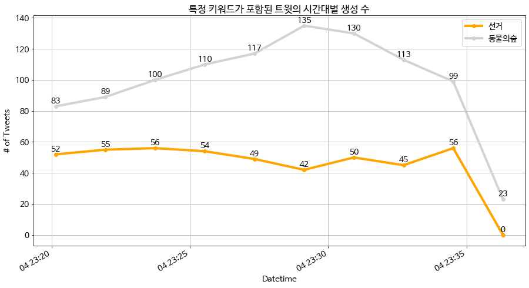
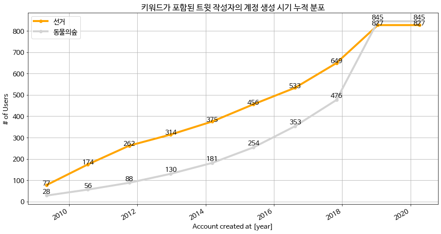
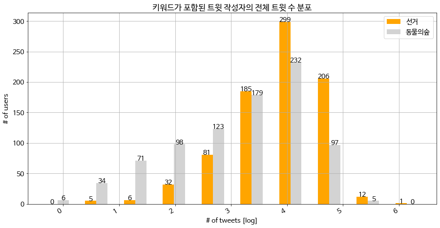
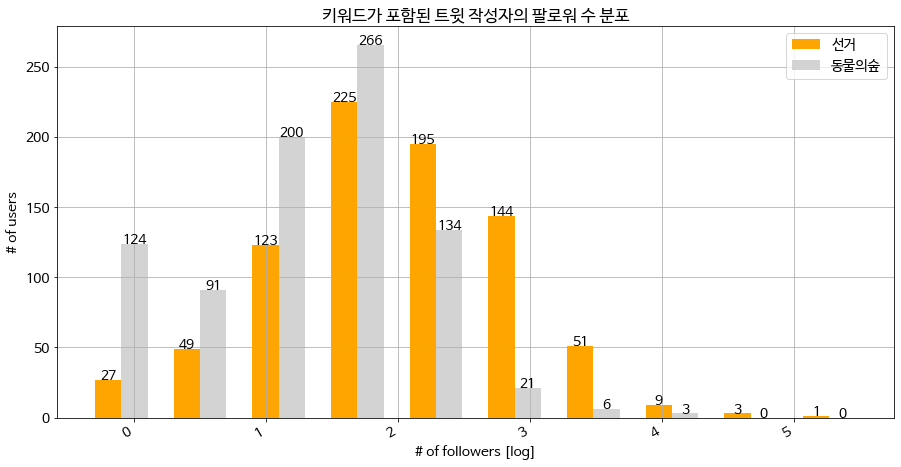
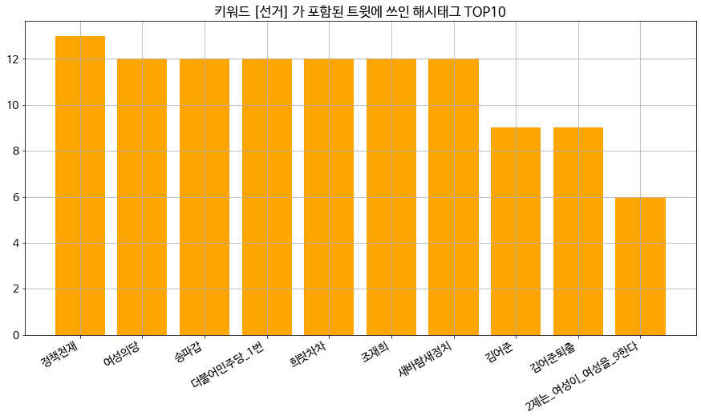
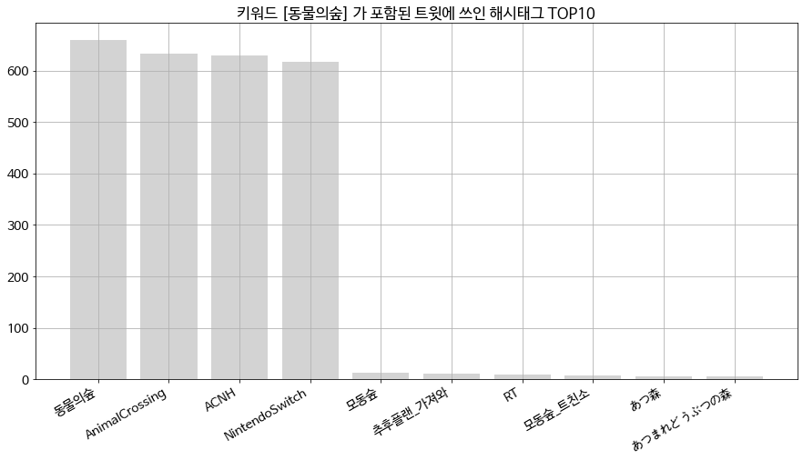
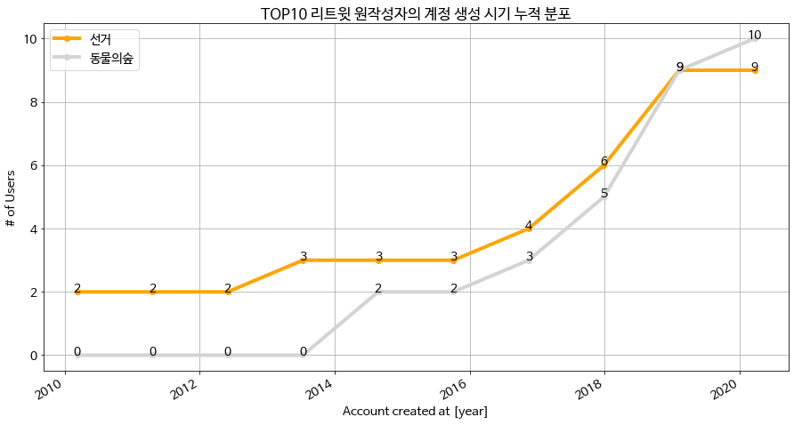

# Tweet Collection Report

2019-24567 구연재


#### Abstract

> 10일밖에 남지 않은 제 21대 국회의원 **'선거'**, 최근 이슈가 되고있는 **'동물의숲'**. 전혀 연관성이 없어보이는 이 두 키워드에 대한 사용자들의 트위터 이용 행태 차이를 간단히 분석해보기 위해 **2020년 4월 4일 토요일 23:36** 기준으로 **각각 1,000개**의 최신 트윗을 가져왔다.
>
> 간단한 기초 통계를 이용해 경험적인 분석을 수행해본 결과, **동물의숲 키워드가 두 배 가량 글의 갱신 속도가 빠르다는 점**, 대체적으로 **동물의숲 키워드를 사용하는 유저가 최근에 계정을 생성한 라이트한 트위터 유저**라는 점, **동물의숲 키워드를 사용하는 유저가 해시태그를 많이 사용하는 경향**이 있다는 점 등을 발견할 수 있었다.
>
> 하지만 **1,000개라는 트윗 수는 생각보다 짧은 기간(선거:37분, 동물의숲:16분)의 트윗만을 포함**하고 있었기에, 이 분석 내용은 일반적인 분석 결과라고 보기는 힘들것이며, **'주말 23시'** 라는 시간적인 특성도 큰 영향을 미쳤을 수 있다는 한계점이 있다.


## I. Basic Statistics

### 언제 트윗되었나?



 **'선거'** 키워드의 경우 최신 1,000개 트윗이 같은 날의 **22:59~23:36(총 37분)** 사이에 분포되어 있었으며, **'동물의숲'** 키워드의 경우 최신 1,000개 트윗이 **23:20~23:36(총 16분)** 사이에 분포되어 있었다. 이 두 시기의 교집합인 23:20~23:36 시각에 대해서 시간대별 트윗 생성 수를 그래프로 표현해본 결과, **'동물의숲' 키워드가 '선거' 키워드에 비해 훨씬 인기있는 키워드**라는 것을 확인할 수 있었다.


### 언제 계정을 만들었나?



최근 1,000개 트윗의 작성자에서 `user id`를 통해 중복 사용자를 제거한 결과, 최종적인 '선거' 키워드의 작성자는 827명, '동물의숲' 키워드는 845명의 작성자가 나왔다. 이들을 계정 생성 시기에 따라 **누적 분포표**로 나타낸 결과, '선거' 키워드 사용자의 경우 2009년부터 2019년까지 꾸준히 50~100명정도가 증가해온 것을 확인할 수 있었다. '동물의숲' 키워드 사용자의 경우에도 2018년 이전까지는 '선거' 키워드 사용자보다는 적지만 일정한 수준으로 꾸준히 증가해온 것을 볼 수 있는데, **특이한 점은 2017년 말과 2019년 사이에 동물의숲 키워드 사용자 전체의 41%에 해당하는 350명의 계정이 생성되었다는 것이다.** 트위터 사용자들은 한 개의 계정만 사용하기보다는 목적에 따라 계정을 새롭게 생성하는 경향이 있다는 점을 미루어 볼 때, **닌텐도 스위치의 한국 최초 출시일이 2017년 12월 1일**인 것이 어느정도 이러한 현상에 영향을 미쳤을 것이라 추측해볼 수 있다.


### 몇개나 트윗했는가?



또한 앞서 살펴본 '선거' 키워드를 작성한 827명, '동물의숲' 키워드를 작성한 845명의 유저들을 '작성한 트윗 수'에 따라 나타내보았다. 트윗의 수는 0개부터 1,000,000개까지 범위가 광범위했으므로 로그스케일로 표현했다. 그 결과, 트윗 1,000개를 기준으로 그 이전에는 '동물의숲' 키워드 사용자가, 그 이후로는 '선거' 키워드 사용자가 더 많이 나타나는 것을 확인할 수 있었다. 그 비율을 살펴보면  **'선거' 키워드 사용자의 경우 85%가 1,000개 이상의 트윗**을 작성했으며, **'동물의숲' 키워드는 사용자는 60%만이 1,000개 이상의 트윗을 작성**했다고 할 수 있다. 이는 앞선 분석에서 살펴보았듯 동물의숲 키워드 사용자가 선거 키워드 사용자에 비해 비교적 최근에 생성된 경우가 많다는 것과 연관이 있을 것으로 생각된다. 


### 수집된 트윗중 가장 팔로워가 많은 사용자는?



위 그래프는 '선거', '동물의숲' 키워드가 포함된 트윗 작성자의 팔로워 수 분포를 로그스케일로 하여 나타낸 것이다. 결과를 살펴보면, 팔로워 100명을 기준으로 그 이전에는 '동물의숲' 키워드 사용자가, 그 이후로는 '선거' 키워드 사용자가 더 많이 나타나는 것을 볼 수 있다. 이를 비율로 나타내보면 **'선거' 키워드 사용자의 경우 48%가, '동물의숲' 키워드 사용자의 경우 19%가 100명 이상의 팔로워를 갖고있다고 할 수 있다**. 이러한 결과는 앞에서 언급한 '몇개나 트윗했는가?'의 결과와 일관성을 가진 것으로, 이를 통해 **동물의숲 키워드 사용자가 선거 키워드 사용자에 비해 상대적으로 트윗 수와 팔로워 수가 적은 '라이트 유저'가 많다고 볼 수 있을 것이다.**


### 가장 많이 나오는 해시태그는?





위 그래프는 '선거', '동물의숲' 키워드가 포함된 트윗에 자주 쓰인 상위 10개의 해시태그를 나타낸 것이다. 이 때 주목해야할 것은 y축의 스케일이다. '선거' 키워드가 포함된 트윗의 경우 가장 자주 쓰인 **'정책천재'** 해시태그가 **13번**만 사용된 것에 비해 '동물의숲' 키워드에서 자주 쓰인 해시태그인 **'동물의숲', 'AnimalCrossing', 'ACNH', 'NintendoSwitch'**의 경우 무려 **600회 이상**이 사용된 것이다. 이를 통해 **동물의숲 키워드 사용자들은 자신이 플레이하는 '동물의숲(AnimalCrossing)' 게임명을 태그하는 경향이 일관되게 있다**는 점을 확인할 수 있었다.


## II. Retweet Statistics

또한 수집된 1,000개의 트윗을 분석하여 가장 많이 리트윗된 트윗 10개를 중복 없이 찾아내어 [리트윗 횟수, 원작성자, 트윗내용] 을 정리해 보았다. 결과는 다음과 같다.

### '선거' 키워드 리트윗 TOP 10

| 순위 | 리트윗 수 |     원작성자     |        트윗 내용 (*truncated된 경우도 그대로 표시함)         |
| :--: | :-------: | :--------------: | :----------------------------------------------------------: |
|  1   |   20463   | @jiwonwithwomen  | RT @jiwonwithwomen: 오늘 홍대입구역 9번 출구 앞에서 이지원 후보가 선거유세를 하였습니다. 그런데 선거유세 도중 한 남성들 무리가 저희에게 돌을 던졌고, 좋은 마음으로 함께 해주신 여성의당 당원분께서 그 돌에 맞으셨습니다. 그 누구도… |
|  2   |   7575    |     @isin00      | RT @isin00: 선거 지면 절대 다음 기회 없습니다. 참여정부 총리였던 최초의 여성총리 한명숙이 '빈 의자에 뇌물을 놔뒀다'는 증언으로 8년형을 받고 정치인생 끝났다는 걸 기억해주십시오. 미통당은 촛불시위를 발포와 쿠데타로 제압하려고 했던 걸… |
|  3   |   7479    |   @doodooo_12    | RT @doodooo_12: 자기맘에 안든다고 사람한테 돌을 던진다? 성경에서나 볼 수 있는 얘기같죠? 여성의당 선거유세 중 여성 당원분이 남자가 던진 돌에 맞았다고 합니다 2020년 맞나요? 네 |
|  4   |   3861    | @womensparty2020 | RT @womensparty2020: ‘여성이라는 이유로’ ‘여성이 자신의 권리를 주장한다는 이유로’ 선거유세 현장에서 돌팔매질을 당하는 정말 말도 안되는 일이 일어났습니다.   바로 오늘 여성의당 이지원 후보의 선거유세에서 벌어진 일입니다. 이것이… |
|  5   |   3844    |  @dongsik_talks  | RT @dongsik_talks: 공감가는 댓글  선거유세하는 여성의당 당원에 돌 던진 남성…경찰 수사 (출처 : 연합뉴스 \| 네이버 뉴스) https://t.co/Hqoj4Vs8KZ https://t.co/lIogXvyRWH |
|  6   |   3625    |  @heejinpics_4   | RT @heejinpics_4: 선거시즌하면 항상 생각나는 거 https://t.co/AnWuzZLjiL |
|  7   |   3145    | @Stephen40610844 | RT @Stephen40610844: “돈이 너무 많이 든다. 그냥 바다에 두자”  세월호 인양을 반대했던 색히가  “정권심판”하자고, “도와주세요”.길바닥에서 대가리를 조아린다.   “정권 심판”이 아니고 세월호 참사로 304 명의 목숨을 바다에… |
|  8   |   3102    |  @Solidarity_R   | RT @Solidarity_R: 여성의당 홍보물 깠던거랑 별개의 사안으로 , 여성의당 선거사무원이 테러를 당한 것 심각한 문제다. 페미니스트 여성 후보들과 각 페미니스트 여성 후보 캠프의 선거원들은 공격당하는 일 없이 선거유세를 할 수 있어야만 한다. |
|  9   |   2480    |    @nnambbang    | RT @nnambbang: 🥊사전투표 많이들 하셔야 합니다.🥊  코로나로인해 선거 당일 붐비는 투표소엘 안가려 다들 생각할겁니다.  그러하기에, 미리 사전투표를 권장하는 캠페인을 여당 지지자들 사이에서 하고 있으니  동참 바랍니다.  🥊사전투표일 -… |
|  10  |   2363    |     @isin00      | RT @isin00: 선거 지면 그냥 끝입니다 다른 기회 없어요 법안 발의 아무리 해도 통과 안됩니다 1당 되었어도 과반 안되니까 법안 통과 안돼 계류된 법안이 몇개입니까 미통당은 대놓고 탄핵시키겠다고 공표했는데 대통령 탄핵정국 되면 여당이 국회에서… |


### '동물의숲' 키워드 리트윗 TOP 10

| 순위 | 리트윗 수 |     원작성자     |        트윗 내용 (*truncated된 경우도 그대로 표시함)         |
| :--: | :-------: | :--------------: | :----------------------------------------------------------: |
|  1   |   41661   |  @SUPERMAGlCPlG  | RT @SUPERMAGlCPlG: 아니...공포게임 동물의숲 https://t.co/gRayrRiJHP |
|  2   |   17570   | @blueberry_proto | RT @blueberry_proto: #동물의숲 #AnimalCrossing #ACNH #NintendoSwitch 별똥별 바다에 쓸려오는거 귀여워 https://t.co/aHzCv4NjIL |
|  3   |   9486    |     @_NAMHT      | RT @_NAMHT: 모동숲 꽃 교배 표! 틀린거 있으면 알려주세요!!   #동물의숲 #AnimalCrossing #ACNH #NintendoSwitch   📎  https://t.co/g6Brs5bPdm  @ACNH_online @ACNH_KR @… |
|  4   |   7347    |     @NdfWef      | RT @NdfWef: RT+팔로우해주신분들 중 한분을 뽑아 닌텐도 스위치 동물의숲 에디션 + 모여봐요 동물의숲 게임팩 을 드립니다 :D  #동물의숲 #모동숲 #닌텐도스위치 #스위치 https://t.co/xxR2Vkhr3v |
|  5   |   5217    |  @ron_crossing   | RT @ron_crossing: ㅋㅋㅋㅋㅋㅋㅋㅋ아시발 살려주세요ㅋㅋㅋㅋㅋㅋㅋㅋㅋㅋㅋ #동물의숲 #AnimalCrossing #ACNH #NintendoSwitch https://t.co/9QPnK3vd6t |
|  6   |   4042    |   @glaceon_sh    | RT @glaceon_sh: 저 튀동때부터 주민들 집옆에 요런 공간 만들어주고 싶었거든요~~! 넬슨 집은 리디광공st라던데 어떻게 꾸며줄지 기분좋은 고민중! #동물의숲 #AnimalCrossing #ACNH #NintendoSwitch https:/… |
|  7   |   3547    |    @ssang006     | RT @ssang006: &lt;무료나눔이벤트&gt; 닌텐도스위치 동물의숲 #알티 +#팔로우 참여완료 4월30일 한분추첨해요  ♡광고글♡ 토스(간편송금어플) 지금가입하면 계좌로바로 3천원지급!!  5분도안걸리니 얼른하러가요~  링크&gt; https://t.co/1… |
|  8   |   3119    |  @Killer_of_men  | RT @Killer_of_men: 당근마켓 스위치 동물의숲 에디션 구매후기 https://t.co/w0avbqtYSq |
|  9   |   2336    |  @GAMEPATRASCHE  | RT @GAMEPATRASCHE: 앞부분의 대사부터 모든게 다 뮤지컬같은 이 순간 #동물의숲 #AnimalCrossing #ACNH #NintendoSwitch https://t.co/atbwsFmY3i |
|  10  |   2218    |    @hmer1261     | RT @hmer1261: #동물의숲 #AnimalCrossing #ACNH #NintendoSwitch 체조하다 벚꽃잎 쫓아가는 뽀야미 봐주세요 https://t.co/YJ0cG1VSFB |

여기에서 흥미로웠던 점은, '동물의숲' 키워드 상위 10개 리트윗에도 앞서 언급한 **자주 사용되는 태그인 '#동물의숲', '#AnimalCrossing', '#ACNH', '#NintendoSwitch' 태그들이 대부분 있었다**는 것이다. 이러한 인기있는 몇몇 트윗에서 해당 태그를 사용했기에 집계에 많이 포함된 것인지, 집계에서 보여준 것처럼 대체적으로 동물의 숲 유저들이 해당 태그를 사용하기에 인기 리트윗의 작성자들도 마찬가지로 이를 사용하는 것인지, 아니면 둘 다인지는 더 자세한 분석이 필요할 것 같다. 또한 **동물의숲 키워드의 인기 리트윗들에는 모두 링크(미디어)가 포함되었다는 점**도 선거 키워드와 비교되는 부분 중 하나이다.


### 코드

```python
### 수집된 트윗을 분석하여 가장 많이 retweet된 (중복이 안되는) 트윗 10개를 찾고
### 이들의 리트윗 횟수, 원작성자, 트윗내용 등을 정리

### 중복 제거 함수
# 리스트와, 리스트 안에서 중복을 구분하기 위해 쓰이는 key의 위치를 받아온다
def remove_duplication(lists, key):
    unique = [] # id를 넣어놓을 어레이
    for v in lists[:]:
        if v[key] not in unique:
            unique.append(v[key])
        else:
            # remove duplication
            lists.remove(v)

# (리트윗 횟수, 원작성자, 트윗내용, 트윗id) 저장
retweets = [ (status['retweet_count'], status['retweeted_status']['user'], status['text'], status['retweeted_status']['id']) for status in statuses if 'retweeted_status' in status]

# 정렬
top_retweets = sorted(retweets, key=operator.itemgetter(0), reverse=True)

# 중복 제거
# top_retweets1 리스트 안에 포함되는 element들의 3번째 요소(=트윗 id)를 key로 전달
remove_duplication(top_retweets, 3)

# 상위 10개만
top_retweets = top_retweets[:10]
```


### TOP10 리트윗 작성자의 계정 생성 시기 분포



마지막으로, TOP10 리트윗을 작성한 계정, 즉 키워드별로 **'영향력이 있다'고 할 수 있는 계정**에 대해 그 **생성 시기 분포**를 분석해보았다. '선거' 키워드의 경우 TOP10 안에 동일한 계정이 두 번 포함되어있기에, 총 계정 수가 9개이다. 분석 결과, **두 키워드 모두 절반 가량은 2018년 이후 생성된 계정**이라는 점이 동일했으며, **동물의숲 키워드의 경우에는 TOP10 리트윗 작성자 모두 2014년 이후에 생성된 계정**이라는 점이 달랐다.


## III. Conclusion

위와 같이 간단한 기초 통계를 이용해 경험적인 분석을 수행해본 결과, **동물의숲 키워드 사용자의 경우가 두 배 가량 글의 갱신 속도가 빠르며, 작성자의 41%가 2017년 말 이후 트위터에 가입했고,  동일한 특정 해시태그를 많이 사용하는 경향**이 있다는 점 등을 발견할 수 있었다.

하지만 **1,000개라는 트윗 수는 생각보다 짧은 기간(선거:37분, 동물의숲:16분)의 트윗만을 포함**하고 있었기에, 이 분석 내용은 일반적인 분석 결과라고 보기는 힘들것이며, **'주말 23시'** 라는 시간적인 특성도 큰 영향을 미쳤을 수 있다는 한계점이 존재한다.