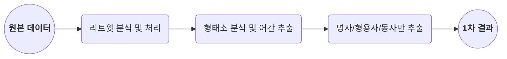
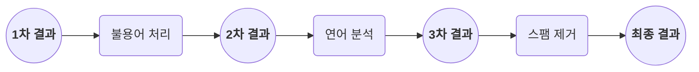
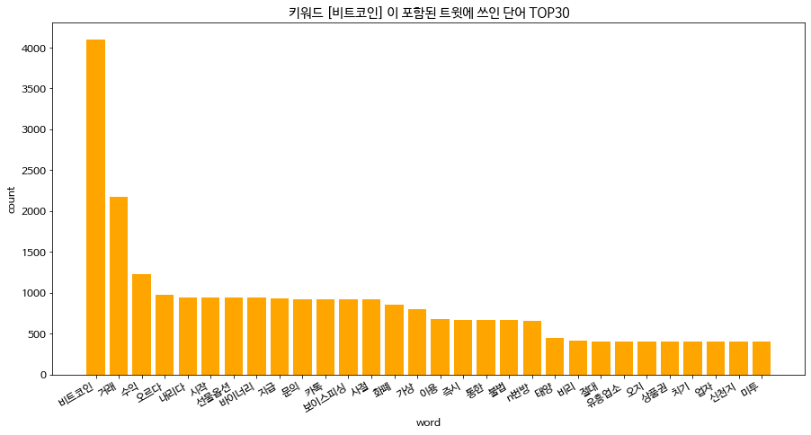
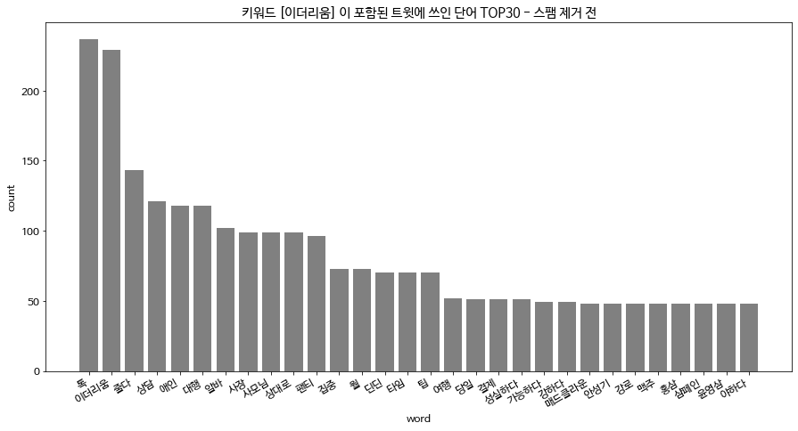
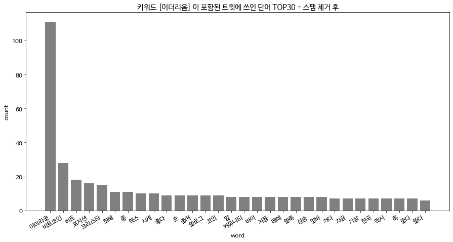
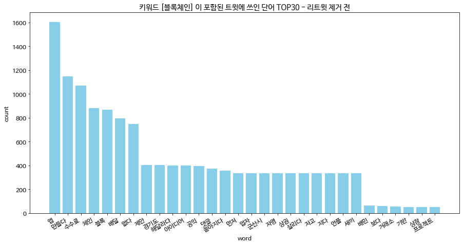
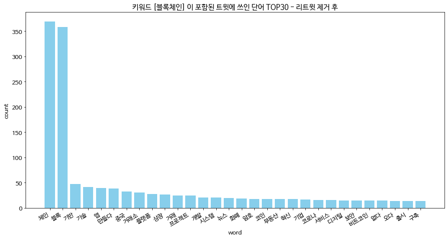
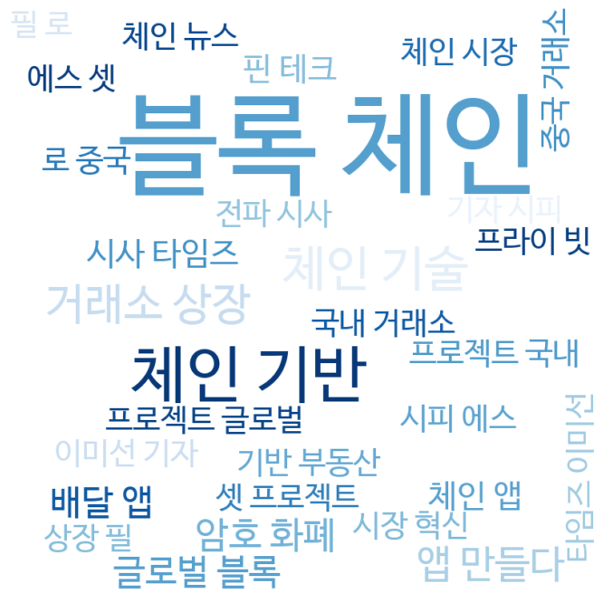

# Tweet Text Analysis using NLP

2019-24567 구연재


#### Abstract

> 4차 산업혁명의 핵심 기술 중 하나로 주목받고 있는 **'블록체인'**, 그리고 블록체인 기술을 이용한 대표적인 암호화페인 **'비트코인'**과 **'이더리움'**. 과연 블록체인 분야가 탈중앙화 플랫폼이라는 새로운 서비스 시대를 열어줄 것인지부터, 돈세탁 및 범죄 이용 가능성, 투자냐 투기냐에 대한 논란까지 관심과 잡음이 끊이지 않고있는데, 이와 관련하여 최근 가장 이슈가 되는 연관 키워드는 무엇인지를 트윗 텍스트 분석을 통해 알아보았다.
>
> **'비트코인', '이더리움', '블록체인'** 키워드를 포함한 **일주일 간 트윗의** 풀 텍스트를 수집하여 분석에 사용했으며, 각각 **4,258개, 220개, 775개의 트윗이 수집**되었다.
>
> 수집된 트윗은 대표적인 한글 자연어 처리 패키지 모음집인 **`konlpy` 의 `Okt` 패키지**[1]를 통해 형태소 단위로 나누었으며, 이 과정에서 패키지에 포함된 **어간 추출(stemming)** 기능을 이용하였다. 또한 분석 결과를 통해, 형태소가 잘못 나뉨으로써 생긴 몇몇 **불용어(stopword)들을 제거**했고, `nltk` 패키지의 **연어(collocation) 분석**[2]을 이용해 해당 단어가 문장에서 어떻게 쓰였는지를 알아봄으로써 **결과의 정확성과 이해도를 개선하**였다.
>
> 분석 결과는 **단어 빈도 그래프** 및 **단어 구름(word cloud)** 을 통해 표현하였으며, 중복된 **리트윗**들을 포함하여 분석했을 때와, 포함하지 않고 오로지 유니크한 트윗들만을 사용해 분석했을 때의 결과를 비교하였다. 전체 수집 트윗의 61%이 리트윗이었던 '블록체인' 키워드의 경우, 리트윗을 포함하였을 때와 포함하지 않았을 때의 단어 구름 차이가 명확한 것을 확인할 수 있었다.
>
> 분석 결과, **'비트코인'**에 관해서는 **'거래', '수익', '오르다', '내리다', '선물옵션'**과 같이 투자와 관련된 단어가 가장 자주 사용되었고, **'보이스피싱', 'n번방', '미투'** 등 범죄 사회 이슈 관련된 키워드들이 눈에 띄었다. **'이더리움'**의 경우, 같은 내용으로 작성된 **스팸 트윗**이 전체 **수집 트윗의 53.6%**에 달했기에 **'애인 대행', '알바'**와 같은 스팸 키워드가 대부분이었는데, 이를 제거하여 분석하니 **'비트코인', '화폐', '시세', '롱', '숏'** 등 역시 투자관련 용어가 눈에 띄었다. 마지막으로 **'블록체인'** 키워드의 경우, 리트윗을 포함하였을 때는 **'수수료 없는', '배달 앱', '경기도 배달'** 등 최근 배달의 민족으로 인해 이슈가 되고 있는 배달 앱 시장 관련 키워드가 상위를 차지했으며, 리트윗으로 인해 중복된 키워드를 제거하자 **'거래소 상장', '핀 테크', '체인 시장'**과 같이 블록체인 기술 분야와 밀접한 용어들이 등장하는 것을 확인할 수 있었다.


## I. Data Crawling

### 분석에 사용된 트윗

2020년 4월 12일 17시 10분을 기준으로 '비트코인', '이더리움', '블록체인' 키워드를 포함하는 지난 **일주일 간**의 트윗을 수집했다. 트윗 수집을 위한 API사용 시, `tweet_mode='extended'` 옵션을 통해 140자가 넘어가는 **풀 텍스트**까지 모두 수집하였다. 수집된 데이터의 정보는 다음과 같다.

|  키워드  | 트윗 수 |   가장 오래된 트윗   |    가장 최신 트윗     |
| :------: | :-----: | :------------------: | :-------------------: |
| 비트코인 |  4,258  | 2020. 4. 4. 16:00:09 | 2020. 4. 12. 17:07:30 |
| 이더리움 |   220   | 2020. 4. 4. 16:30:20 | 2020. 4. 12. 15:33:28 |
| 블록체인 |   775   | 2020. 4. 4. 16:30:22 | 2020. 4. 12. 16:33:52 |


## II. Data Processing

위의 방식대로 모아진 원본 텍스트 데이터는 다음과 같은 절차를 통해 처리되었다.

### 1. 기본 형태소 분석 작업



##### (i) 리트윗 분석 및 처리

|  키워드  | 총 트윗 수 | 리트윗 수 | 고유 트윗 비율 |
| :------: | :--------: | :-------: | :------------: |
| 비트코인 |   4,258    |   1,177   |     72.4%      |
| 이더리움 |    220     |     7     |     96.8%      |
| 블록체인 |    775     |    476    |     38.6%      |

먼저 원본 데이터에 리트윗이 몇개인지, 즉 고유(unique)한 트윗의 비율이 어떻게 되는지를 분석해보았다. 분석 결과 비트코인과 이더리움 키워드에 대해서는 고유 트윗 비율이 비교적 높았기에, 중복된 텍스트를 담고 있는 리트윗을 제거하든 하지 않든 비슷한 결과가 예상되었으나, 블록체인 키워드의 경우 고유 트윗 비율이 낮아서 리트윗 제거 여부에 따라 결과가 다르게 나올 수 있을거라 생각이 되었다.

실제로 모든 키워드에 대해서 1) 리트윗을 모두 포함시켰을 때와, 2) 고유 트윗만을 포함시켰을 때로 나누어 분석해본 결과, 블록체인 키워드의 경우에서 눈에 띄는 차이를 확인할 수 있었다.

##### (ii) 형태소 분석 및 어간 추출(stemming)

```python
tokens = []
for text in texts:
    # IN : ETF거래소 오를때
    token = okt.pos(text, norm=True, stem=True)
    tokens.append(token)
    # OUT : [('ETF', 'Alpha'), ('거래소', 'Noun'), ('오르다', 'Verb'), ('때', 'Noun')]
```

형태소 분석과 어간 추출의 경우 `konlpy` 에 포함된 `okt` 패키지[1]를 사용하였다.

##### (iii) 명사/형용사/동사만 추출

```python
words = []
for word, tag in tokens[i]:
    # IN : [('ETF', 'Alpha'), ('거래소', 'Noun'), ('오르다', 'Verb'), ('때', 'Noun')]
    if tag in ['Noun', 'Adjective', 'Verb']:
        words.append(word)
    # OUT : ['거래소', '오르다', '때']
```

위와 같이 (i)과 (ii)의 추출 과정을 통해, 최종적으로는 'ETF거래소 오를때' 라는 문장에서 ['거래소', '오르다', '때']와 같은 리스트를 얻어낼 수 있게 된다.

하지만 이를 통해 도출된 1차 결과는 **불용어들을 걸러내지 못했다는 한계점**이 존재했다. 예를 들면, 위의 경우에서도 '때' 라는 단어가 쓰였는데, '오르다'나 '거래소'같은 단어에 비해 '때'라는 단어는 큰 의미를 포함하지 못하고 있었기 때문이다. 1차 결과를 분석해보니, 이와 같이 **불필요하면서 사용률이 매우 상위에 위치해 있는 단어들이 몇몇 있었기에 이러한 단어들을 제거**하는 작업이 필요했다.


### 2. 결과 개선 작업



##### (i) 불용어(stopword) 처리 및 잘못 분석된 형태소 변환

```python
# stopword 제거
stop_words = ['때', '더', '창', '이', '점', '환', '알', '내', '번', '하다', '있다', '되다', '같다', '않다', '그냥', '보기', '아주', '진짜', '수', '것', '이다', '등', '위', '및', '재', '손', '걸', '거', '줄', '또', '냥', '게다', '해도', '움', '대다', '추다']
for word in words[:]:
    if word in stop_words:
        words.remove(word)

# 리움 -> 이더리움
# 같은 방식으로 번방 -> n번방
for i, word in enumerate(words):
    if word == '리움':
        words[i] = '이더리움'
```

1차 결과를 토대로, 가장 대표적인 불용어라고 판단된 것들을 리스트로 만들어 불용어 처리했다. 또한 '이더리움'을 한가지 단어로 인식하지 못하고 '더', '리움' 으로 인식하게 되는 등 잘못 분석된 대표적인 형태소의 경우 알맞은 단어로 변환시켜 주었다.

이를 통해 **비트코인 트윗에 등장한 73,037개의 단어중 12,686개의 불용어**가, **이더리움 트윗에 등장한 5,925개 단어중 646개의 불용어**가, **블록체인 트윗에서는 21,563개 단어중 2,469개의 불용어**가 삭제되었다. 또한 총 **267개의 '리움'이 '이더리움'으로 대체**되었으며 **657개의 '번방'이 'n번방'으로 대체**되었다.

##### (ii) 연어(collocation) 분석

```python
# 연어 분석
measures = collocations.BigramAssocMeasures()
collocations_dic = {}
for word in words:
    finder = collocations.BigramCollocationFinder.from_words(word)
    scored = finder.score_ngrams(nltk.collocations.BigramAssocMeasures().raw_freq)
    # 연관성이 높은 상위 30개 조합을 공백으로 join하여 collocations_dic에 추가
    for wordscore in scored[:30]:
        w = ' '.join(str(i) for i in wordscore[0])
        collocations_dic[w] = wordscore[1]
```

연어 분석이란 **전후 연관성이 있는 단어를 분석**하는 것이다. 예를들면 '블록체인' 키워드의 경우, '블록', '체인' 두 단어로 따로 집계되는데,  `nltk` 패키지에서 제공하는 연어 분석[2] 함수를 통해 이러한 단어를 '블록 체인' 으로 묶어 집계해볼 수 있다.

이러한 **연어 분석은 결과를 해석하고 이해하는 데 큰 도움**이 되었다. **'수수료가 없다'** 는 의미로 쓴 문장이 단순히 **'수수료', '없다'** 이 두가지 키워드로 분리되어서 단어 구름으로 표현되는 경우, **'없다' 라는 형용사는 대체 무엇이 없다는 것인지 전혀 알 수 없게되기 때문이다.** 이를 연어 분석을 통해 '수수료 없다' 라는 한 단어로 묶어 단어 구름으로 표현함으로써 결과 이해도를 더욱 향상시킬 수 있었다.

##### (iii) 스팸 제거


연어 분석까지 마친 3차 분석 결과에서, 특이하게도 **'이더리움'** 키워드의 경우 **'애인 대행', '알바'**와 같은 스팸 키워드가 모든 상위 키워드를 차지하고 있다는 것을 발견했다. 텍스트들을 분석해 본 결과, 실제로 이더리움 키워드를 통해 수집한 지난 일주일간 220개의 트윗중 118개, 즉 **53.6%가 스팸 트윗**인 것을 확인할 수 있었다. 이를 해결하고자 중복된 텍스트 내용을 제거하여 스팸 트윗을 걸러내고, 98개의 트윗만을 분석에 사용하니 **'비트코인', '화폐', '시세', '롱', '숏'** 등 정상적인 키워드가 나타나게 되었다.


## III. Result & Discussion

### 비트코인



|                      기본 분석                      |                     연어 분석 적용                     |
| :-------------------------------------------------: | :----------------------------------------------------: |
|  |  |

 **'비트코인'**에 관해서는 **'거래', '수익', '오르다', '내리다', '선물옵션'**과 같이 투자와 관련된 단어가 가장 자주 사용되는 것을 확인할 수 있었다. 그 외의 것으로는 **'보이스피싱', 'n번방', '유흥업소', '미투'** 등 사회 범죄 이슈와 관련된 키워드들이 눈에 띄었다.

**연어 분석**을 적용한 단어 구름 결과가 특히 흥미롭다. '수익', '내리다' 로 따로 처리된 두 단어가 **'내리다 수익'**으로 연결되었기에 문장에서 '내리다'가 어떻게 쓰였는지 더욱 쉽게 이해할 수 있었다. '바이너리 거래', '보이스피싱 사절', '가상 화폐', '미투 n번방' 등도 마찬가지로 어떤 트윗이 있었고 어떤 이슈가 있었는지에 대해 두 단어가 따로 있는 것 보다 훨씬 더 문맥의 이해를 돕는다.


### 이더리움





|                  |                         기본 분석                         |                        연어 분석 적용                        |
| :--------------: | :-------------------------------------------------------: | :----------------------------------------------------------: |
| **스팸 제거 전** |  |  |
| **스팸 제거 후** |       |       |

 **'이더리움'**의 경우, 같은 내용으로 작성된 **스팸 트윗**이 전체 **수집 트윗의 53.6%**에 달했다. 따라서 **'애인 대행', '알바'**와 같은 스팸 키워드가 대부분이었는데, 이를 제거하여 분석하니 **'비트코인', '화폐', '시세', '롱', '숏'** 등 투자관련 용어가 눈에 띄었다.

또한 **연어 분석**을 적용하니 역시 문맥을 파악하기가 훨씬 수월했다. 단순히 '롱', '숏' 이었던 투자용어가 '비트코인 숏', '이더리움 롱', '롱 포지션' 이 되는 식이다. 특히, **'이더리움 클래식'**은 하나의 **고유명사**인데, 형태소 분석 과정에서 '이더리움', '클래식' 으로 완전히 해체되어 있었다. 하지만 연어 분석 적용 후에는 '이더리움 클래식' 으로 잘 나타나는 것을 확인할 수 있었다.


### 블록체인





|                    |                          기본 분석                           |                        연어 분석 적용                        |
| :----------------: | :----------------------------------------------------------: | :----------------------------------------------------------: |
| **리트윗 제거 전** |  |  |
| **리트윗 제거 후** |        |     |

 **'블록체인'** 키워드의 경우, 위에서 언급한대로 **수집 트윗의 61%이 리트윗**이었으므로 리트윗의 제거 유무에 따라 나타나는 단어 양상이 달랐다.

**리트윗을 포함하였을 때**는 **'수수료', '배달', '경기도', '아이디어', '공익'** 등 최근 배달의 민족으로 인해 이슈가 되고 있는 배달 앱 시장 관련 키워드가 상위를 차지한 것으로 보아, 이러한 **사회적 이슈 관련한 트윗**이 많이 리트윗 되었다는 것을 알 수 있었다. 실제로 경기도 시장 이재명이 4일 자신의 페이스북을 통해 독과점 배달앱 횡포 억제를 위해 아이디어 제안해달라며 글을 쓰자, "경기도 배달앱 만들자" "블록체인 앱" "수수료없는 공익앱 만들자" 등의 댓글이 쏟아졌다는 뉴스가 있었다[3]. 이러한 뉴스가 활발히 리트윗 되었음은 연어 분석을 적용한 단어 구름에서 **'수수료 없다', '블록 체인', '배달 앱', '앱 만들다', '댓글 쏟아지다'** 등의 키워드를 통해 더욱 확실하게 확인할 수 있었다.

**리트윗으로 인해 중복된 키워드를 제거**하자 **'거래소', '암호', '비트코인', '시스템'**과 같이 전반적인 블록체인 기술 분야 용어들이 등장하는 것을 확인할 수 있었다. 연어 분석에서도 마찬가지로 '체인 기반', '핀 테크', '프라이빗', '거래소 상장' 등, 리트윗이 많이 되는 사회 이슈보다는 전반적인 블록체인 관련 용어들이 나타나는 현상이 뚜렷했다.


## IV. Conclusion

'비트코인', '이더리움', '블록체인' 키워드에 대해 지난 일주일간의 트윗을 분석한 결과, **비트코인**은 **투자 및 사회 범죄 이슈**와 밀접한 관련이 있다는 것, **이더리움** 키워드는 **스패머**로 인해 고통받고 있지만 이를 제거하면 **투자** 관련한 키워드가 대부분이라는 것, **블록체인** 키워드의 경우 평상시에는 전반적인 **블록체인 시스템 관련 용어**가 많이 나타나지만, 최근 이재명 경기도지사의 **배달 앱** 관련 발언으로 수수료 없는 블록체인 배달 앱 만들기 관련 키워드가 인기가 많다는 것 등을 파악해볼 수 있었다.

기본적인 분석에서 그치지 않고 **스팸 제거, 리트윗 제거**를 하여 비교 분석하였기에 분석의 설득력을 더욱 높일 수 있었으며, 무엇보다도 **연어 분석**을 통해 단어가 사용된 문맥을 쉽게 파악할 수 있었다는 점에서 결과의 이해도 또한 의미있게 높였다고 생각한다.


## References

[1] 박은정, 조성준, "KoNLPy: 쉽고 간결한 한국어 정보처리 파이썬 패키지", 제 26회 한글 및 한국어 정보처리 학술대회 논문집, 2014.

[2] "NLTK documentation", http://www.nltk.org/howto/collocations.html.

[3] "이재명 '배민' 손본다..독과점 배달앱 횡포 억제", 2020.4, https://news.v.daum.net/v/20200404221331642.