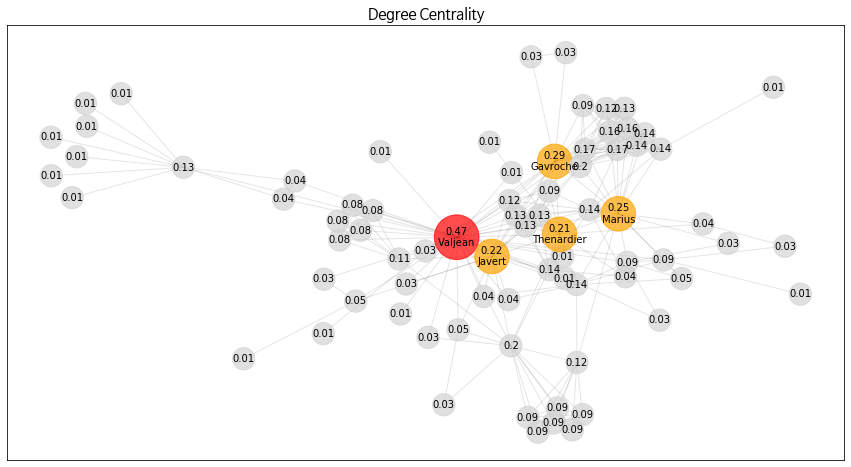
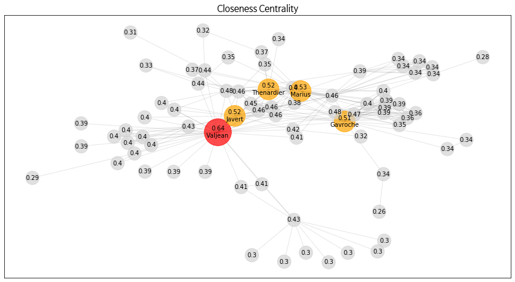
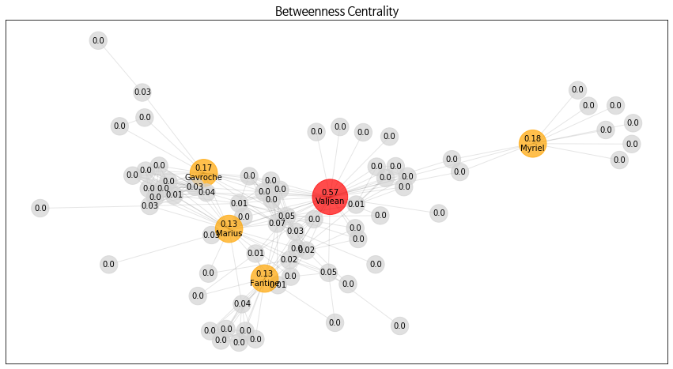
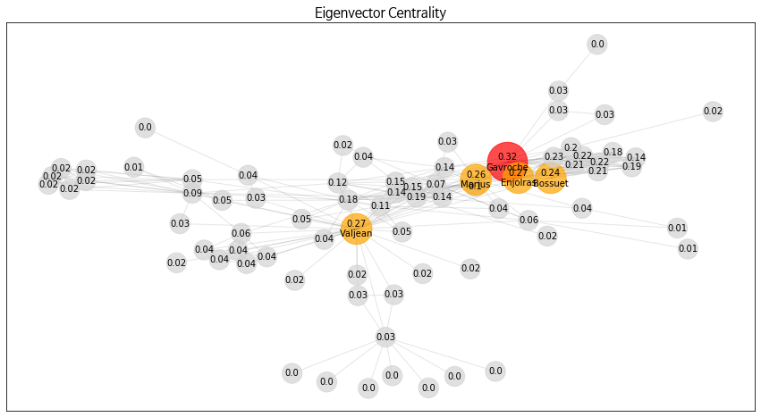
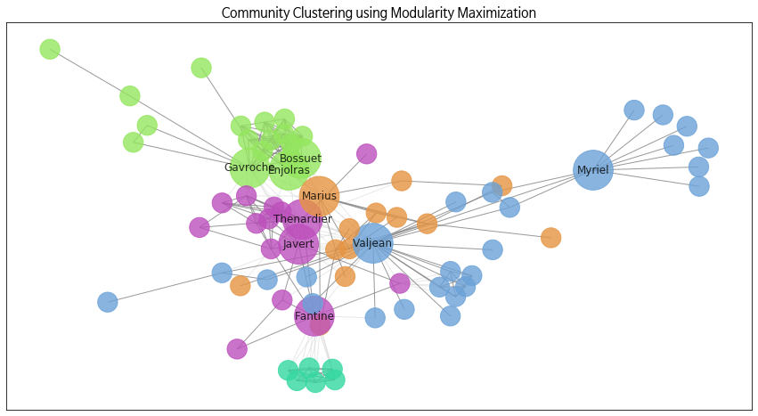
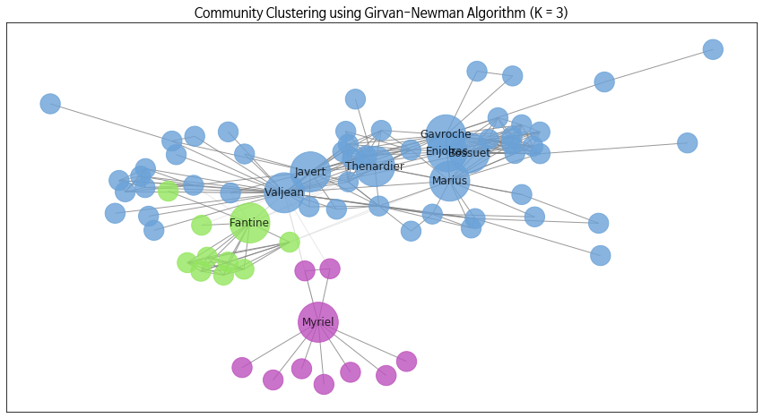
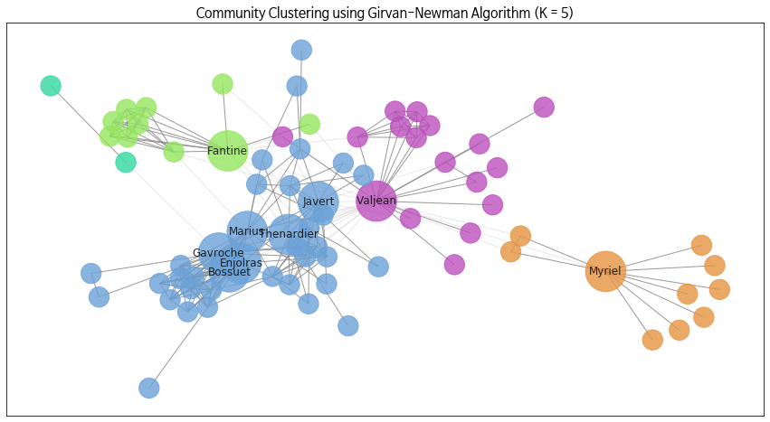
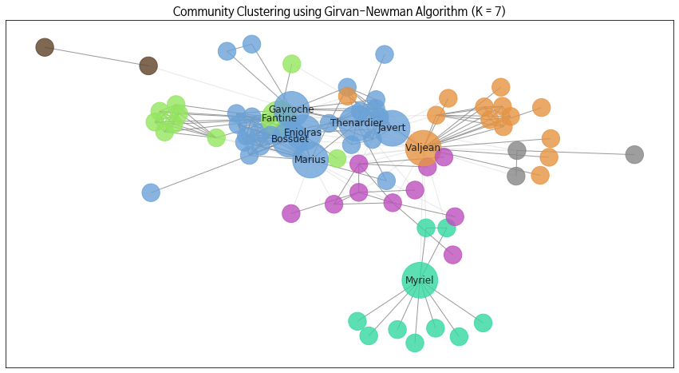
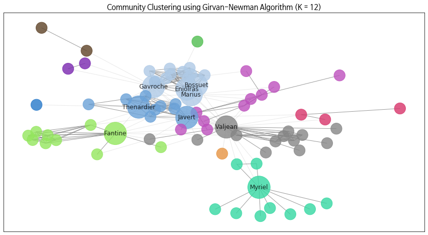

# 2020-04-06 과제

2019-24567 구연재

## Network Book 3.7 Exercises

#### #2
Weak tie일 것이다. b-c 노드 사이가 strong tie라면 e-c, b-f 간에도 tie가 있어야 하는 것이 strong triadic closure property이기 때문이다.

#### #3.
A : satisfy (B-D 간 tie 존재)
B : satisfy (A-C 간 tie 존재)
C : NOT satisfy (B-E간 tie 존재 X)
D : satisfy (A-E간 tie 존재)
E : NOT satisfy (C-D간 tie 존재 X)

#### #4.

C, E (C는 B-E간에, E는 C-D간에 tie 존재 X)

#### #5.

A : satisfy (B-C간 tie 존재)
B : satisfy (A-C간 tie 존재)
C : NOT satisfy (A-E간, B-E간 tie 존재 X)
D : satisfy
E : satisfy

## 레미제라블 데이터셋 분석

### I. Centrality가 높은 상위 5명 인물은?

레미제라블 co-occurence 데이터셋을 토대로 그래프를 생성하고, 이에 대해 centrality를 측정하는 4가지 measure (Degree Centrality, Closeness Centrality, Betweenness Centrality, Eigenvector Centrality) 를 각각 사용하여 상위 5명의 등장인물을 비교해보았다. 가장 Centrality가 높은 노드는 빨간색으로, 이를 제외한 상위 4개 노드는 주황색으로 나타내었다.

#### Degree Centrality

> **Valjean** > Gavroche > Marius > Javert > Thenardier

**Degree Centrality**란 **연결된 노드의 수**를 척도로 하여 centrality를 측정하는 방식이다. **극의 주인공인 장발장(Valjean)이 다른 노드와 큰 차이를 갖고 가장 높은 centrality**를 나타낸 것을 확인할 수 있었다. 그 이후로는 가브로슈(Gavroche), 마리우스(Marius), 자베르(Javert), 테나르디에(Thenardier)가 뒤따랐다.

#### Closeness Centrality

> **Valjean** > Marius > Javert = Thenardier > Gavroche

**Closeness Centrality**란 모든 노드와의 **거리가 가까울 수록**, 즉 다른 모든 노드와의 거리의 합이 작을 수록 centrality를 높게 측정하는 방식이다. degree를 척도로 했을 때와 마찬가지로 **장발장(Valjean)이 가장 centrality가 높은 것**을 확인할 수 있었으며, 그 뒤를 따르는 인물들도 일치했다. 다만 가브로슈(Gavroche)의 경우만 순위가 5번째로 밀려났는데, 그 수치의 차이가 0.01정도로 근소했다. 아무래도 많은 노드와 연결되어 있을 경우, 다른 노드에 도달하는 방법도 다양해지기 때문에 거리가 가까워질 가능성 또한 커질 것이다. 이러한 이유 등으로, **Degree Centrality와 Closeness Centrality가 어느정도 일관된 결과**를 보여주었다고 말할 수 있다.

#### Betweenness Centrality

> Valjean > **Myriel** > Gavroche > Marius > Fantine

**Betweenness Centrality**란 **노드간의 최단 경로(Shortest Path)에 있을수록** centrality를 높게 측정하는 방식이다. 따라서 노드 A의 centrality를 구하기 위해서는 모든 노드 간 최단 경로를 구한 뒤, 그 중 노드 A를 지나는 경로가 차지하는 비율이 몇 퍼센트인지 계산하면 된다. 앞서 살펴본 Degree Centrality가 단순히 많은 노드와 연결되어 있다면 높은 점수를 받는 것과는 다르게, **이 척도에서 높은 점수를 받기 위해서는 클러스터된 커뮤니티와 커뮤니티 사이의 다리 역할에 위치해야 한다**고 보면 된다.

따라서 이 전의 두 경우와는 조금 다른 인물이 상위에 위치한 것이 눈에 띄었다. **미리엘 주교의 경우 다양한 인물들과 접하는 역할은 아니므로 Degree Centrality에선 상위 18번째에 위치**해 있었는데, 다른 등장인물들과 접점이 거의 없는  'OldMan', 'Napoleon', 'Count' 라는 인물 등을 다른 인물들과 이어주는 **다리 역할을 하기에 Betweenness Centrality가 높게 나온 것**을 확인할 수 있었다. 

#### Eigenvector Centrality

> **Gavroche** > Valjean > **Enjolras** > Marius > Bossuet

**Eigenvector Centrality**란 **큰 네트워크에 연결되어있는 큰 사람**일 수록 높은 centrality를 갖는 방식이다. 따라서 앞서 언급한 Betweenness Centrality에서, 분량이 적은 인물들(e.g.  'OldMan', 'Napoleon', 'Count')과 다른 인물들의 다리 역할을 해준다는 점에서 높은 점수를 받아 **2위**를 차지했던 **미리엘 주교의 경우, 큰 네트워크에 연결되어있다고는 볼 수 없으므로 Eigenvector Centrality 에서는 높은 점수를 받지 못하는 것을 확인할 수 있었다**. **(46위)**

그 외에도 **가브로슈**가 장발장보다 수치가 높게 나와 **1위**를 차지한 것, **앙졸라(Enjolras), 보쉬에(Bossuet)**가 순위에 처음 등장한 것 등이 눈에 띄었다. 가브로슈의 경우 장발장에 비해 **연결된 노드의 수 등은 적지만 더 큰 커뮤니티 그룹에 속하기 때문에** 더 수치가 높게 나온 것으로 생각되며, **앙졸라**의 경우에도 '아베쎄의 벗들(Les amis de l'ABC)'의 리더로, **비교적 큰 네트워크에 연결되어있는 큰 노드**이기에 eigenvector centrality가 높게 나온 것으로 판단된다.

### II. 인물들간 커뮤니티 그룹

인물들간 커뮤니티 그룹을 나누는 것에도 여러 알고리즘이 있는데, 그 중에서도 `networkx.algorithms.community` 패키지에 포함된 `greedy_modularity` (Modularity Maximization) 함수와 `girvan_newman` (Girvan-Newman Algorithm) 함수를 사용하여 커뮤니티를 나누어보았다.

그래프에는 커뮤니티별로 색상을 다르게 표현했으며, 인물 이름의 경우 챕터 I. 에서 centrality가 높은 상위 5명으로 언급된 바 있는 9명의 인물('Gavroche', 'Valjean', 'Enjolras', 'Marius', 'Bossuet', 'Myriel', 'Fantine', 'Javert', 'Thenardier')에 대해서만 표시했다.

#### Modularity Maximization

| 커뮤니티 ID |                특징                |                          속한 인물                           |  수  |
| :---------: | :--------------------------------: | :----------------------------------------------------------: | :--: |
|      1      |      장발장, 미리엘 관련 인물      | 'MmeDeR', 'Marguerite', 'MotherInnocent', 'CountessDeLo', 'Brevet', 'Scaufflaire', 'Woman1', 'OldMan', 'MlleBaptistine', 'Judge', '**Myriel**', 'Labarre', 'Cravatte', 'Cochepaille', 'Gribier', 'Champmathieu', 'Geborand', 'Chenildieu', 'Napoleon', 'Isabeau', 'Count', '**Valjean**', 'Gervais', 'MmeMagloire', 'Champtercier', 'Fauchelevent' |  26  |
|      2      |      아베쎄의 벗들 관련 인물       | 'Feuilly', 'MmeHucheloup', '**Bossuet**', 'Mabeuf', 'Child2', 'Combeferre', 'Prouvaire', 'Jondrette', 'Child1', '**Gavroche**', '**Enjolras**', 'MmeBurgon','MotherPlutarch', 'Courfeyrac', 'Bahorel', 'Joly', 'Grantaire' |  17  |
|      3      | 팡틴, 테나르디에, 자베르 관련 인물 | '**Fantine**', 'Anzelma', 'Montparnasse', 'Eponine', 'Brujon', 'Babet', 'Claquesous', 'MmeThenardier', '**Thenardier**', 'Simplice', 'Boulatruelle', 'Bamatabois', '**Javert**', 'Gueulemer', 'Perpetue' |  15  |
|      4      |     마리우스, 코제트 관련 인물     | 'Magnon', 'MmePontmercy', 'LtGillenormand', '**Marius**', 'Tholomyes', 'Toussaint', 'Pontmercy', 'MlleGillenormand', 'BaronessT', 'Gillenormand', '**Cosette**', 'Woman2', 'MlleVaubois' |  13  |
|      5      |     팡틴과 어울렸던 과거 인물      | 'Dahlia', 'Favourite', 'Blacheville', 'Fameuil', 'Zephine', 'Listolier' |  6   |

**Modularity Maximization**을 통한 커뮤니티 클러스터링 결과, **5개의 그룹**으로 나뉘어 지는 것을 확인할 수 있었다. **커뮤니티 1**의 경우, **장발장-미리엘**과 관련한 장면의 인물들이 주를 이루었는데, 커뮤니티 규모가 가장 큰 것에 비해 극 전체로 따져봤을 때 이를 구성하는 인물들의 비중은 그리 크지 않았다. (e.g. 'Woman1', 'OldMan', 'Judge')

**커뮤니티 2**의 경우 마리우스를 제외한 **아베쎄의 벗들** 관련한 인물들이 모두 속해있는 것을 확인할 수 있었다. (e.g. 'Feuilly', 'Bossuet', 'Combeferre', 'Prouvaire', 'Enjolras', 'Courfeyrac', 'Bahorel', 'Joly', 'Grantaire')

또한 **커뮤니티 3**에는 **팡틴, 테나르디에 가문 관련한 인물**들, 그리고 자베르가 속해 있으며, **커뮤니티 4**는 **마리우스와 코제트** 관련 인물들이 속한 것을 볼 수 있었다. 마리우스의 경우 아베쎄의 벗들이긴 하지만, 코제트와의 러브라인이 있기에 커뮤니티 4에 같이 속한 것으로 보인다.

마지막으로 **커뮤니티 5**는, 분량이 적은 생소한 인물들로 보이나 찾아본 결과 6인 모두 과거 **팡틴과 어울렸던 인물들**인 것으로 확인되었다.

커뮤니티 1~5 모두 작중 흐름상 연결된 인물(장발장-미리에, 팡틴-테나르디에, 마리우스-코제트, 팡틴의 과거 친구들), 그리고 이념에 따른 중요 집단(아베쎄의 벗들 vs 자베르)들을 잘 분류하고 있는 것으로 보여지므로, **전체적으로 소설의 흐름이 잘 반영**되었다고 할 수 있다.

#### Girvan-Newman Algorithm

**Girvan-Newman Algorithm**은 전체 그래프에서 **모든 노드가 분리될 때까지 betweenness가 높은 edge들을 제거해가는 방식**으로 커뮤니티를 나눈다. 따라서 edge를 제거해나가는 과정에서 어느 시점의 커뮤니티가 가장 적절할 지, 즉 **커뮤니티를 몇개(K)로 나눈 것이 가장 소설의 흐름과 일치하는 지** 직접 비교 및 분석 해보았다.

#### 커뮤니티 수가 3개일 때 (K=3)

| 커뮤니티 ID |                  특징                  |                          속한 인물                           |  수  |
| :---------: | :------------------------------------: | :----------------------------------------------------------: | :--: |
|      1      | 장발장, 자베르 포함 주요 등장인물 모두 | 'MmeDeR', 'Cosette', 'Anzelma', 'LtGillenormand', 'Claquesous', 'MotherInnocent', 'Child1', 'Child2', 'MlleGillenormand', 'MotherPlutarch', 'Brevet', 'Scaufflaire', 'Woman1', 'MlleVaubois', 'Eponine', 'Judge', 'Babet', 'Jondrette', 'Boulatruelle', 'BaronessT', 'Gillenormand', 'Labarre', 'MmeBurgon', 'Cochepaille', 'Woman2', 'Grantaire', 'MmeHucheloup', 'Magnon', 'Champmathieu', 'Bossuet', 'Fauchelevent', 'Mabeuf', 'Brujon', 'Gribier', 'Thenardier', 'Courfeyrac', 'Bahorel', 'Bamatabois', 'Joly', 'Gueulemer', 'Feuilly', 'Chenildieu', 'MmePontmercy', 'Montparnasse', 'Isabeau', '**Valjean**', 'Combeferre', 'Prouvaire', 'Gervais', 'MmeThenardier', 'Marius', 'Toussaint', 'Pontmercy', 'Simplice', 'Gavroche', 'Enjolras', '**Javert**' |  57  |
|      2      |         팡틴과 그의 과거 인물          | '**Fantine**', 'Dahlia', 'Favourite', 'Blacheville', 'Tholomyes', 'Marguerite', 'Fameuil', 'Zephine', 'Listolier', 'Perpetue' |  10  |
|      3      |   미리엘과 그의 등장 장면 관련 인물    | 'Napoleon', 'OldMan', 'MlleBaptistine', 'Count', '**Myriel**', 'MmeMagloire', 'CountessDeLo', 'Geborand', 'Champtercier', 'Cravatte' |  10  |

그룹을 3개로 나누니 일단 **그룹 분류 자체는 명확**했다. 커뮤니티 1에는 장발장, 자베르를 포함한 주요 등장인물들이 모두 포함되었고, 커뮤니티 2는 팡틴과 그의 과거 친구들이, 커뮤니티 3은 마리엘 주교와 그가 등장하는 장면에 나온 인물들이 나타났다. 하지만 **이러한 분류의 문제점은, 모든 비중 있는 등장인물들이 동일하게 커뮤니티 1에 묶여져 있다는 것**이다.

커뮤니티 수를 늘리면 이러한 문제를 해결할 수 있는지 확인하기 위해, 또 Modularity Maximization 방식의 해답과 비교해보기 위해 커뮤니티 수를 5로 해보았다.

#### 커뮤니티 수가 5개일 때 (K=5)

| 커뮤니티 ID |               특징                |                          속한 인물                           |  수  |
| :---------: | :-------------------------------: | :----------------------------------------------------------: | :--: |
|      1      |  자베르, 아베쎄의 벗들 관련 인물  | 'Anzelma', 'LtGillenormand', 'Claquesous', 'Child1', 'MlleGillenormand', 'MotherPlutarch', 'MlleVaubois', 'Child2', 'Eponine', 'Babet', 'Boulatruelle', 'BaronessT', 'Gillenormand', 'Woman2', 'Grantaire', 'MmeHucheloup', 'Magnon', 'Bossuet', 'Mabeuf', 'Brujon', '**Javert**', 'Thenardier', 'Courfeyrac', 'Bahorel', 'Joly', 'Gueulemer', 'Feuilly', 'MmePontmercy', 'Montparnasse', 'Combeferre', 'Prouvaire', 'MmeThenardier', '**Marius**', 'Toussaint', 'Pontmercy', '**Gavroche**', '**Enjolras**', '**Cosette**' |  38  |
|      2      |       팡틴과 그의 과거 인물       | 'Fantine', 'Dahlia', 'Favourite', 'Blacheville', 'Listolier', 'Marguerite', 'Fameuil', 'Zephine', 'Tholomyes', 'Perpetue' |  10  |
|      3      | 장발장과 그의 등장 장면 관련 인물 | 'MmeDeR', 'Chenildieu', 'Champmathieu', 'Fauchelevent', 'Isabeau', 'MotherInnocent', 'Judge', 'Gribier', 'Gervais','**Valjean**', 'Simplice', 'Labarre', 'Brevet', 'Bamatabois','Scaufflaire', 'Cochepaille', 'Woman1' |  17  |
|      4      | 미리엘과 그의 등장 장면 관련 인물 | 'Napoleon', 'OldMan', 'MlleBaptistine', 'Count', '**Myriel**', 'MmeMagloire', 'CountessDeLo', 'Geborand', 'Champtercier', 'Cravatte' |  10  |
|      5      |   다른 인물과 접점이 적은 인물    |                   'Jondrette', 'MmeBurgon'                   |  2   |

위의 그래프와 표에서 확인할 수 있듯, 커뮤니티 2, 4의 경우 K=3 에서의 커뮤니티 2,3 과 동일하다. 즉 **K=3 에서의 커뮤니티 1이 K=5의 커뮤니티 1, 3, 5 세 가지로 나뉘어**졌다는 뜻이다. 이를 살펴보면, **커뮤니티 1은 자베르와 아베쎄의 벗들 관련 인물**이고, **커뮤니티 3은 장발장과 그의 등장 장면 관련 인물**이다.

눈에 띄는 것은 **커뮤니티 5**인데, 'Jondrette'는 테르나디에 부부가 사기행각을 벌일 때 사용한 가명이라고 하는데 'MmeBurgon'의 경우 어떤 등장인물인지 찾아보아도 확인할 수 없었다. **아마 다른 이들과 접점이 크게 없는, 중요도가 낮은 노드들이 betweenness가 높은 edge의 제거로 인해 다른 커뮤니티와의 접점이 사라지면서, 커뮤니티 5로 묶인 것이라 추정**된다. 

#### 커뮤니티 수가 7개일 때 (K=7)

| 커뮤니티 ID |               특징                |                          속한 인물                           |  수  |
| :---------: | :-------------------------------: | :----------------------------------------------------------: | :--: |
|      1      |  자베르, 아베쎄의 벗들 관련 인물  | 'Anzelma', 'Claquesous', 'Child1', 'MotherPlutarch', 'Child2', 'Eponine', 'Babet', 'Boulatruelle', 'Grantaire', 'MmeHucheloup', 'Bossuet', 'Mabeuf', 'Brujon', 'Thenardier', 'Courfeyrac', 'Bahorel', 'Joly', 'Gueulemer', 'Feuilly', 'Montparnasse', 'Combeferre', 'Prouvaire', 'MmeThenardier', '**Marius**', 'Pontmercy', '**Gavroche**', '**Enjolras**', '**Javert**' |  28  |
|      2      |       팡틴과 그의 과거 인물       | '**Fantine**', 'Dahlia', 'Favourite', 'Blacheville', 'Listolier', 'Marguerite', 'Fameuil', 'Zephine', 'Tholomyes', 'Perpetue' |  10  |
|      3      |   코제트와 그의 등장 관련 인물    | 'Magnon', 'MmePontmercy', 'LtGillenormand', 'Toussaint', 'MlleGillenormand', 'BaronessT', 'Gillenormand', '**Cosette**', 'Woman2', 'MlleVaubois' |  10  |
|      4      | 장발장과 그의 등장 장면 관련 인물 | 'MmeDeR', 'Chenildieu', 'Champmathieu', 'Fauchelevent', 'Isabeau', 'MotherInnocent', 'Judge', 'Gribier', 'Gervais','**Valjean**', 'Simplice', 'Labarre', 'Brevet', 'Bamatabois','Scaufflaire', 'Cochepaille', 'Woman1' |  14  |
|      5      | 미리엘과 그의 등장 장면 관련 인물 | 'Napoleon', 'OldMan', 'MlleBaptistine', 'Count', '**Myriel**', 'MmeMagloire', 'CountessDeLo', 'Geborand', 'Champtercier', 'Cravatte' |  10  |
|      6      |   다른 인물과 접점이 적은 인물    |                   'Jondrette', 'MmeBurgon'                   |  2   |
|      7      |   다른 인물과 접점이 적은 인물    |         'Gribier', 'Fauchelevent', 'MotherInnocent'          |  3   |

K=7에서는, K=5의 커뮤니티 1에 있었던 '코제트와 그의 등장 관련 인물' 10명이 새로운 커뮤니티 3으로 묶이게 되었다. 또한 **betweenness가 높은 edge들을 제거해간다는 알고리즘의 특성상, 다른 이들과 접점이 크게 없는 노드들끼리 묶이는 현상**도 계속 확인할 수 있었다 (커뮤니티 7).

즉,

* **1) 어떤 중요 인물 한명과 그의 주변인물끼리 묶이거나(커뮤니티 1~5)**
* **2) 중요도가 낮은 노드들끼리 묶이는 것(커뮤니티 6~7)**

위의 두 사항이 Girvan-Newman Algorithm의 특징이라고 할 수 있겠다.

하지만 이러한 특징은 동시에 한계점이라고 볼 수도 있다. 작중에서 가장 중요한 커뮤니티 중 하나가 이념의 대립으로 인해 생기는 커뮤니티 (e.g. 자베르 / 아베쎄의 벗들) 라고 생각하는데, 중요도가 낮은 노드로만 이루어진 커뮤니티 수가 많다보니, 이러한 맥락을 반영하기 위해선 **K=12**까지 가야했기 때문이다. (아래 그림 참조)

#### 커뮤니티 수가 12개일 때 (K=12)

위에서 언급했듯이, **커뮤니티를 12개**로 나누니 **비로소 주요 등장인물들간의 커뮤니티가 원작의 흐름을 제대로 반영하여 나뉜 것을 볼 수 있었다**. (아베쎄의 벗들 / 테나르디에,자베르 / 장발장 / 미리엘 / 팡틴)

**주요 인물이 포함된 5개의 커뮤니티의 분류는 적절**하긴 하나, 문제점은 **중요도가 낮은 노드로만 이루어진 커뮤니티가 7개가 더 있다**는 것이었다. 이는 위에서 언급한 Girvan-Newman Algorithm의 특징이자 한계점이라고 볼 수 있다.

### III. Conclusion

레미제라블 원작의 co-occurence 데이터셋을 이용해 4가지 measure(Degree, Closeness, Betweenness, Eigenvector)에 따른 centrality와 인물들간의 커뮤니티 그룹을 분석해 본 결과, 먼저 **Centrality measure간 눈에 띄는 차이는 '커뮤니티' 라는 맥락을 반영하냐, 반영하지 않느냐**였다. Degree centrality는 커뮤니티라는 컨텍스트는 크게 고려되지 않고 단순히 한 노드가 **얼마나 많은 다른 노드와 연결**되느냐를 계산하는 반면, betweenness centrality의 경우 **얼마나 많은 '다른 커뮤니티의' 노드와 연결**되느냐도 반영되기 때문이다. 이에 더해, eigenvector centrality는 **얼마나 많은 다른 '큰' 커뮤니티의 노드와 연결**되느냐가 반영된다고 볼 수 있었다.

이를 잘 확인할 수 있었던 극적인 예시는 **'미리엘 주교'** 였다. 미리엘 주교의 경우 다양한 인물들과 접하는 역할은 아니기에, **Degree centrality에서는 상위 18번째**에 그쳤지만, 다른 등장인물과 접점이 없는 인물들(e.g. 'OldMan', 'Count')에게 다리 역할을 해주기에 **Betweenness Centrality에서는 2위**를 차지했다. 하지만, 이 인물들이 큰 네트워크에 속한 것은 아니기에 **Eigenvector Centrality에서는 또 높은 점수를 받지 못하고 46위**에 그쳤다.

인물들 사이의 커뮤니티 그룹 분석에는 Modularity Maximization과 Girvan-Newman 알고리즘을 사용했다. **Modularity maximization의 경우 그룹을 5개로 나누는 경우가 채택**되었으며, 작중 흐름상 연결된 인물(장발장-미리에, 팡틴-테나르디에, 마리우스-코제트, 팡틴의 과거 친구들), 그리고 이념에 따른 중요 집단(아베쎄의 벗들 vs 자베르)들을 잘 분류함으로써 전체적으로 **소설의 흐름이 잘 반영**되었다고 할 수 있었다. **Girvan-Newman** 알고리즘의 경우, **betweenness가 높은 엣지들을 제거해간다는 알고리즘의 특성상, 다른 이들과 접점이 크게 없는 노드들끼리 묶이는 현상이 확인** 되었는데, 이러한 특징이자 한계점으로 인해 작중 이념 대립을 반영한 커뮤니티로 분류하기 위해서는 **12개의 커뮤니티로 나누어야만 했다**. 이 중 **5개만이 시나리오상 의미있다고 생각되는 커뮤니티**였고, 나머지 7개는 betweenness가 높은 edge의 소실로 인해 고립된 비중이 적은 노드들의 커뮤니티였다.