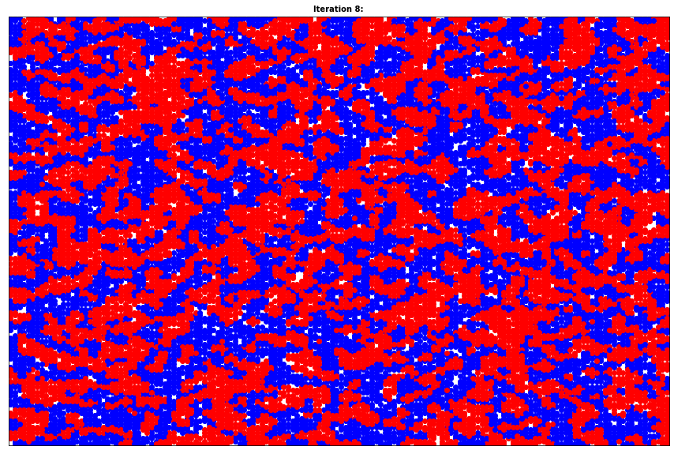
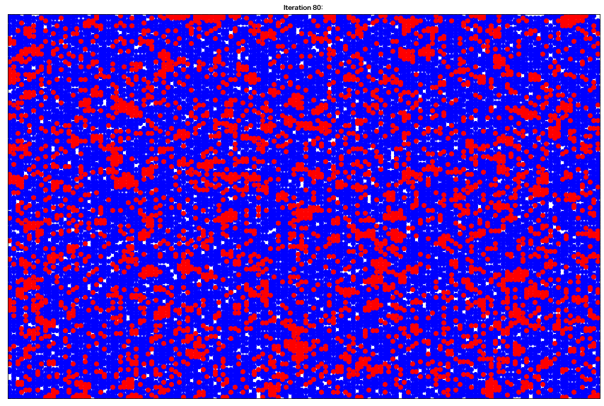
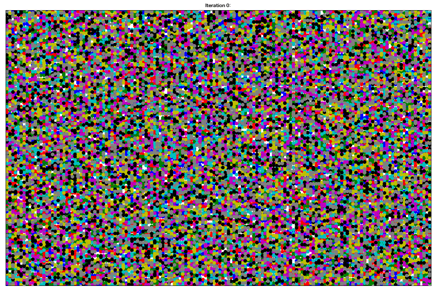

# 2020-04-13 과제

<p style="text-align: right">2019-24567 구연재</p>


## Network Book 4.6 Exercises

#### #2.

(a) 다음과 같이 projected graph를 그릴 수 있다.


(b) 아래 두 그래프의 경우 서로 다른 affiliation networks지만, projected graph는 같다.


#### #3.
(a) 다음과 같이 그릴 수 있다.


(b) A-C-E 세 노드는 triangle을 형성하긴 하지만, A-B-C 노드의 Triangle과 같이 같은 foci에 속한 것이 아니다. A-C가 그룹 X, C-E가 그룹 Z, A-E가 그룹 Y로 공통되기 때문에 triangle이 형성된 것이다.

#### #4.

(a) 다음과같은 bipartite 그래프로 나타낼 수 있다.


(b) projected graph에 triangle 이 4개 있기 때문이다. 


## Shelling 모델 실습

### I. 그림 4.18 에 대한 실험

#### Parameter Setting

> 조건 : 150 rows, 150 columns, 10,000 agents of each type, 2500 empty cells

* 그림 4.18과 같은 조건에서 시뮬레이션을 돌릴 수 있도록, 수업시간에 주어진 코드에서 다음과 같은 변수의 값을 바꾼 뒤 매 iteration마다 그래프를 그려보았다.

  ```python
  width = 150 # 150 rows
  height = 150 # 150 columns
  similarity_threshold = 0.375 # (threshold=3 이므로, 8개중 3개는 일치해야 하므로 3/8=0.375)
  n_empty = 2500 # 2500 empty cells
  ```

#### Results

> 결과

| 초기 상태 (Iteration : 0) | 최종 상태 (Iteration : 18) |
| ------------------------- | -------------------------- |
|         |         |

> 과정

|    Iteration : 1    |    Iteration : 2    |    Iteration : 3    |
| :-----------------: | :-----------------: | :-----------------: |
|   |   |   |
|  **Iteration : 4**  |  **Iteration : 5**  |  **Iteration : 6**  |
|   |   |   |
|  **Iteration : 7**  |  **Iteration : 8**  |  **Iteration : 9**  |
|   |   |   |
| **Iteration : 10**  | **Iteration : 11**  | **Iteration : 12**  |
|  |  |  |
| **Iteration : 13**  | **Iteration : 14**  | **Iteration : 15**  |
|  |  |  |
| **Iteration : 16**  | **Iteration : 17**  | **Iteration : 18**  |
|  |  |  |

#### Discussion

위 과정 그래프를 보아도 알 수 있듯이, **iteration 10정도까지는 그래프가 비교적 급격히 바뀌지만 나머지 iteration에서는 큰 차이를 느낄 수 없었다**. 실제로, 움직임이 있는 노드들의 수(Number of changes)도 뒤에 갈수록 급격히 줄어들지 않는 모습을 보였는데, 이에 대해 그래프로 나타내면 다음과 같다.


### II. 소수 인종이 있으면 어떻게 되는가? (threshold에 따른 차이 관찰)

#### Parameter Setting

> 조건 : 150 rows, 150 columns, 2500 empty cells

* 위의 실험과 같은 조건에서, **인종의 비율을 각각 20%(빨간 점), 80%(파란 점)로 설정**한 뒤 시뮬레이션
  * 인종 1(빨간 점) : 4,000 agents 
  * 인종 2(파란 점) : 16,000 agents

* 또한 **threshold에 따른 segregation을 알아보기 위해 threshold=3, 6에 대해 실험**해보았다.

#### Results

#### 1. threshold가 3일 때

threshold를 3으로 설정했을 경우, **iteration이 200을 넘어가도 전혀 수렴되지 않는 양상**을 보였다.
(변화하는 노드의 수가 줄어들지 않았음)

> 결과

| 초기 상태 (Iteration : 0) | 최종 상태 (Iteration : 200) |
| ------------------------- | --------------------------- |
|       |       |

> 과정

|     Iteration : 40     |     Iteration : 80     |
| :--------------------: | :--------------------: |
|   |   |
|  **Iteration : 120**   |  **Iteration : 160**   |
|  |  |

#### 2. threshold가 6일 때

threshold를 6으로 설정했을 경우**, segregation이 수렴해가는 것을 확인**할 수 있었다.

> 결과

| 초기 상태 (Iteration : 0) | 최종 상태 (Iteration : 111) |
| ------------------------- | --------------------------- |
|       |       |

> 과정

|    Iteration : 10     |    Iteration : 30     |
| :-------------------: | :-------------------: |
|  |  |
|  **Iteration : 50**   |  **Iteration : 70**   |
|  |  |

#### Discussion


소수 인종이 존재하는 경우, **threshold가 3**으로 설정되면 인종의 비율이 1:1이었을 때와는 다르게 **아무리 iteration 수가 커지더라도, segregation이 되는 방향으로 전혀 수렴하지 않는다**는 것을 알 수 있었다. 반면 **threshold를 6**으로 설정하니, iteration이 반복되며 점점 **segregation이 일어나는 것을 관찰**할 수 있었으며 최종적으로는 111번째 iteration에서 더이상 변화하는 노드가 없는 수준으로 최종 수렴했다. 따라서, **소수 인종이 존재한다면 threshold가 커진다**고 할 수 있다.


### III. 다수의 인종에도 적용이 되는가?

#### Parameter Setting

> 조건 : 150 rows, 150 columns, 2500 empty cells, threshold=3

* 위의 실험과 같은 조건에서, **인종의 수를 각각 4, 8로 설정**한 뒤 시뮬레이션
  * race = 4 :  5,000 agents of each type
  * race = 8 :  2,500 agents of each type

#### Results

#### 1. 인종의 수가 4일 때

> 결과

| 초기 상태 (Iteration : 0) | 최종 상태 (Iteration : 35) |
| ------------------------- | -------------------------- |
|       |       |

> 과정

|    Iteration : 10     |    Iteration : 15     |
| :-------------------: | :-------------------: |
|  |  |
|  **Iteration : 20**   |  **Iteration : 25**   |
|  |  |

#### 2. 인종의 수가 8일 때

> 결과

| 초기 상태 (Iteration : 0) | 최종 상태 (Iteration : 109) |
| ------------------------- | --------------------------- |
|       |       |

> 과정

|    Iteration : 20     |    Iteration : 40     |
| :-------------------: | :-------------------: |
|  |  |
|  **Iteration : 60**   |  **Iteration : 80**   |
|  |  |

#### Discussion


실험 결과, **다수의 인종에서도 segregation이 적용되는 것을 관찰**할 수 있었다. 위 그래프는 Iteration에 따른 number of changes를 인종 수(race)별로 그린 것이다. **race=8의 경우도 수렴이 잘 되지만, iteration이 훨씬 많이 돌아야 한다는 것을 확인**할 수 있었다.


### IV. 결론

본 과정에서는 Shelling 모델을 시뮬레이션 해보았다. [I] 에서는 교재의 그림 4.18과 동일한 설정에서 실험을 재현해 보았으며, [II]과 [III]에서는 각각 인종의 비율과 threshold, 인종의 수를 조정해보며 segregation 현상을 시뮬레이션 해보았다. 이 결과, **소수인종이 존재할 경우 threshold가 커진다**는 사실과, **다수의 인종에서도 해당 모델은 적용이 되지만 segregation 현상을 관찰할 때까지는 더 많은 iteration 횟수를 필요로 한다**는 사실을 확인할 수 있었다.