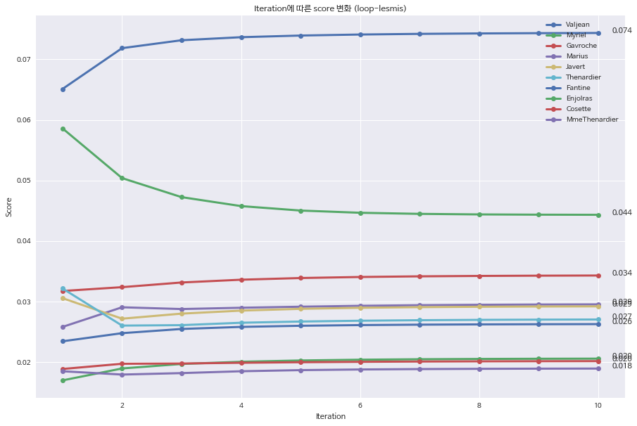
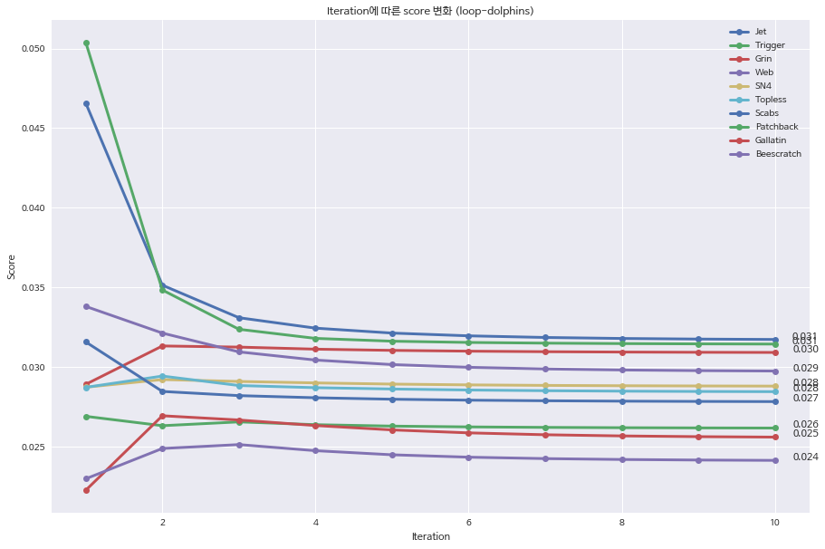
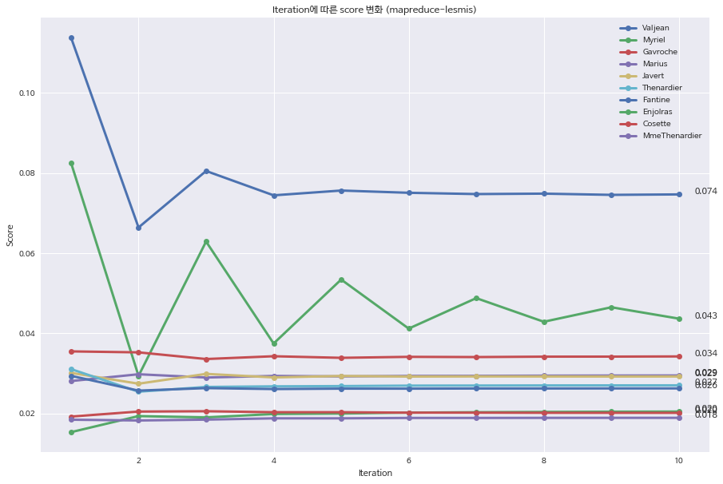
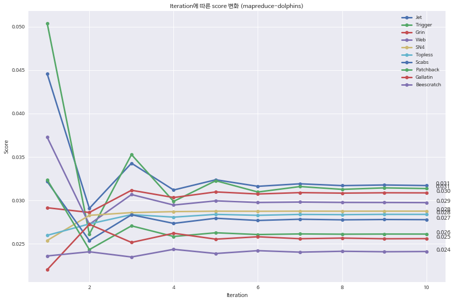
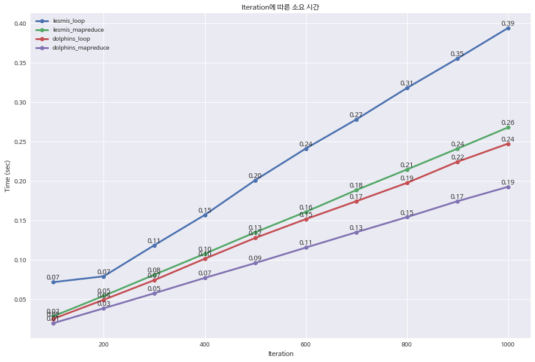

# 2020-04-20 과제

<p style="text-align: right">2019-24567 구연재</p>


## Network Book 13.6 Exercises

#### #1.

* SCC : 1, 3, 4, 8, 9, 13, 14 ,15, 18
* IN : 6, 7, 11, 12
* OUT : 5, 10, 16
* tendrils : 2, 17

#### #2.

(a) 예를들어 엣지 (5 -> 9) 를 추가한다면 SCC의 크기가 더 커질 수 있다. (node 5가 추가됨)

(b) 엣지 (2 -> 8) 을 추가한다면 IN의 크기가 더 커질 수 있다. (node 2가 추가됨)

(c) 엣지 (15 - > 17) 을 추가한다면 OUT의 크기가 더 커질 수 있다. (node 17이 추가됨)

#### #3.

(a) SCC 안에 포함된 최소 1000개의 다른 노드간의 bridge역할을 해주는 edge를 지우게 된다면, 그 bridge를 통해서만 도달 가능했던 1000개의 노드들이 SCC에서 빠지게 된다.

(b) a의 경우와는 반대로, 만약 bridge역할을 해줄 edge가 하나만 있었더라면 SCC에 포함될 수 있는 노드들이 OUT에 있는 경우가 있을 것이다. 그러한 노드가 1000개 있다고 한다면, bridge역할을 해줄 edge를 하나 추가한다면 OUT의 그러한 노드 1000개가 SCC에 포함될 것이다.


## Network Book 14.7 Exercises

#### #1.

[Before normalizeation step] A: 6, B: 14, C: 6, D: 4, E: 4

[After normalizeation step] A: 3/10, B: 7/10, C: 3/7, D: 2/7, E: 2/7

#### #2.

(a)

[Before normalizeation step]  A,B,D,E : 1,  C,F,G,H : 9

[Afternormalizeation step]  A,B : 1/11, C: 9/11, D,E : 1/29, F,G,H: 9/29

(b)

[Before normalizeation step]  A: 1, B: 5, C: 17, D: 1, E: 22, F,G,H: 17

[Afternormalizeation step]  A: 1/23, B: 5/23, C: 17/23, D:1/74, E: 22/74, F,G,H: 17/74

(c) B가 더 높은 점수를 얻게 되었다. B를 가리키는 hub(E)가 점수가 높은 authority인 C를 동시에 가리키게 되었으므로 그 hub(E)의 점수가 높아졌기 때문이다.

#### #3.

(a)

[Before normalizeation step] A: 11, B: 7, C: 11, D: 11, E: 18, F: 7

[Afternormalizeation step] A: 11/18, B: 7/18, C: 11/47, D: 11/47, E: 18/47, F: 7/47

(b)

[Option 1] A: 11/19, B: 7/19, X: 1/19

[Option 2] A: 23/41, B: 10/41, X: 8/41

옵션 2에서 X가 더 높은 점수를 받는다. X를 가리키고있는 허브인 Y가 점수가 높은 authority인 A,B 를 같이 가리키고 있기 때문이다. (#2-(c)와 같은 원리)

(c) Y, Z가 X, A 를 가리키게한다. (B는 가리키지 않음)

#### #4.

(a) equalibrium이다. Basic PageRank Update Rule 을 한번 더 적용시켜도 값이 바뀌지 않기 때문이다.

(b) equalibrium이 아니다. Basic PageRank Update Rule 을 한번 더 돌려보면 값이 바뀌기 때문이다. equalibrium 상태가 되려면 A: 4/12, B: 2/12, C: 2/12, D: 1/12, E: 2/12, G: 1/12 이어야 한다. 


## PageRank 분석 수행

수업시간에 배운 내용을 토대로 PageRank 알고리즘을 Loop 방식, MapReduce 방식으로 구현한 뒤 결과를 비교해보았다. PageRank github의 `lesmis.csv`와 `dolphins.csv` 두 가지 데이터셋에 대해 분석을 수행하였으며, 모든 수행에서 beta값은 0.8로 설정했다.

### I. Loop 방식으로 구현한 PageRank Algorithm

먼저 Loop 방식으로 구현한 PageRank 분석 결과이다. 아래 두 결과 그래프는 lesmis와 dolphins 각각의 데이터에 대해, **최종적으로 score가 높게나온 상위 10개 노드**를 나타낸 것이다. iteration에 따른 수렴도를 보기 위해 iteration 1~10 사이의 score를 표현하였다.

그 결과, **3~4번째 iteration까지는 노드간의 score 순서가 바뀌기도 하지만, 그 이후로는 거의 변화량이 미미했다**. 그래프에는 표현하지 않았지만 iteration을 10000회까지 수행했을 때에도 iteration을 10회 수행했을 때의 값과 크게 달라지지 않았다.

> lesmis.csv 분석 결과



> dolphins.csv 분석 결과




### II. MapReduce 방식으로 구현한 PageRank Algorithm

다음으로는 MapReduce 방식으로 구현한 PageRank 분석 결과이다.

먼저 **최종적으로 수렴하는 값을 보면, Loop 방식으로 구현했을 때와 Score가 일치**하는 것을 확인할 수 있다. 눈에 띄는 차이점은 **수렴 과정에서, 수렴값을 기준으로 진동하며 수렴해간다는 것**이다. 이와같은 방식때문에 특정 노드(e.g. lesmis.csv의 Myriel)의 경우 Score값이 **수렴하는 데 10회 이상의 iteration이 필요하기도** 했지만, 그래도 대부분의 노드가 10번째 iteration 안에는 수렴하는 경향을 보였다.

> lesmis.csv 분석 결과



> dolphins.csv 분석 결과




### III. 논의

위의 두 실험 결과, Loop 방식과 MapReduce 방식으로 구현한 PageRank 알고리즘 간에 아래와 같은 공통점과 차이점을 발견할 수 있었다.

* 공통점 : 같은 결과값으로 수렴함
* 차이점 : MapReduce 방식의 경우 진동해가며 수렴하며, 따라서 더 많은 iteration을 필요로 하는 경우가 있음

수업시간에 배운 내용에 의하면 MapReduce 방식이 더 방대한 데이터를 처리하기에 알맞아야 하는데, 값이 수렴하게 되는 데에 더 많은 iteration을 필요로한다면 불리하다고 생각할 수도 있을 것이다. 이러한 **'퍼포먼스' 부분에 대해 분석해보고자 iteration 수에 따른 각 알고리즘의 소요시간을 측정**해보았다. 

#### 퍼포먼스 비교 실험



퍼포먼스 비교를 위해 100에서 1,000회까지의 Iteration에 따른 각 알고리즘의 소요시간을 측정해본 결과, **소요 시간은 Iteration 수에 선형적으로 비례**했고, **lesmis 데이터의 경우 MapReduce 방식이 Loop 방식보다 1.5배, dolphins 데이터의 경우 1.26배 빨랐다**. 이러한 결과는 수업시간에 배웠던 내용과도 일치하는 것으로, **MapReduce 방식이 퍼포먼스에 강점**이 있다는 것을 확인해볼 수 있었다.

하지만 사실 **위 실험에서는 MapReduce 알고리즘을 쓰레드를 나눠 동시수행해가며 실제 분산환경처럼 수행해본 것이 아니므로**, 위 결과는 수업시간에 배웠던 **MapReduce 방식의 강점이 제대로 반영된 결과는 아니다**. MapReduce 방식이 더 빠를 수 있는 이유는, mapper와 reducer에서 일어나는 연산들이 서로 독립적이므로 동시수행이 가능하기 때문이다. loop 방식을 사용한다면 그 내부의 연산이 모두 sequential하게 수행해야만 올바르게 동작한다.


### IV. 결론

본 실험에서는 수업시간에 배운 내용을 토대로 PageRank 알고리즘을 Loop 방식, MapReduce 방식으로 구현한 뒤 결과를 비교해보았다. 그 결과, 두 알고리즘 모두 최종 score 값은 같다는 공통점이 있었지만 MapReduce 방식의 경우 진동해가며 수렴하기에 더 많은 iteration을 필요로 하는 경우가 있다는 차이점이 있었다. 퍼포먼스(시간)적 측면으로는 MapReduce가 1.5배정도 빠른 것으로 나타났다. 

하지만 본 실험에서는 MapReduce 알고리즘 내부의 독립적인 연산들을 쓰레드를 나눠 가며 동시수행한 것이 아니기에, 실제 분산 환경에서 MapReduce 방식의 강점을 제대로 반영해내지 못했다는 한계점이 있다. 실제로 쓰레드를 나눠서 내부의 독립적인 연산들을 동시수행한다면, 나눠진 쓰레드 수에 따라 시간이 선형적으로 감소할 것으로 예상된다.


### Appendix: 코드

> initialize_graph

```python
def initialize_graph(filename):
    graph = nx.Graph()
    reader = csv.reader(open(filename, 'r'), delimiter=',')
    data = [row for row in reader]
    nodes = set([row[0] for row in data])
    edges = [(row[0], row[2]) for row in data]
    num_nodes = len(nodes)
    initial_rank = 1/float(num_nodes)
    graph.add_nodes_from(nodes, rank=initial_rank)
    graph.add_edges_from(edges)
    return graph, initial_rank
```


> pagerank_loop

```python
def pagerank_loop(filename, iteration, beta):
    graph, _ = initialize_graph(filename)
    V = float(len(graph))
    s = beta
    ranks = dict()
    
    # initialize (1/N)
    for key, node in graph.nodes(data=True):
        ranks[key] = node.get('rank')

    # pagerank iteration
    for _ in range(iteration):
        # 모든 노드에 대해 rank 업데이트
        for key, node in graph.nodes(data=True):
            rank_sum = 0.0
            neighbors = graph[key]
            for n in neighbors: # for each neighbors, gather its pagerank
                if ranks[n] is not None:
                    # key의 이웃 중 하나인 n의 degree = outlinks
                    outlinks = len(list(graph.neighbors(n)))
                    # key가 n으로부터 받게 되는 rank 는 1/outlinks * ranks[n]
                    rank_sum += (1 / float(outlinks)) * ranks[n]
            # 이웃으로부터 온 rank_sum 에서 s 곱한만큼만 받는다
            ranks[key] = ((1 - s) * (1/V)) + s*rank_sum

    return ranks
```


> pagerank_mapreduce

```python
def mapper(graph, page_id, value):
    neighbors = graph[page_id]
    outputs = [(page_id, value)] # (이름, [rank값, [이웃]])
    out_pagerank = value[0]/len(value[1])
    for neighbor in neighbors:
        outputs.append((neighbor, out_pagerank))
    return outputs

def reducer(graph, page_id, values, beta):
    sum = 0
    for value in values:
        if type(value) == list :
            # page
            output = value
        else:
            sum += value
    d = beta
    output[0] = (1-d)/float(len(graph)) + d*sum
    return (page_id, output)

def map_reduce(graph, dataset, mapper, reducer, beta):
    # Make intermediate list using mapper
    intermediate = []
    for (key,value) in dataset.items():
        intermediate.extend(mapper(graph, key, value))
        
    # Make groups
    groups = {}
    for (key, value) in intermediate:
        if key not in groups:
            groups[key] = []
        groups[key].append(value)
    
    # Make output dict using reducer
    output = {}
    for (key, values) in groups.items():
        (new_key, new_value) = reducer(graph, key, values, beta)
        output[new_key] = new_value
    return output

def pagerank_mapreduce(filename, iteration, beta):
    graph, initial_rank = initialize_graph(filename)
    pages = {} # {page_id: [pagerank, neighbors]}
    for page_id, node in graph.nodes(data=True):
        neighbors = graph.neighbors(page_id)
        neighbors_ids = [ neighbor for neighbor in neighbors ]
        value = [initial_rank, neighbors_ids]
        pages[page_id] = value
    result = {}
    for i in range(iteration):
        result = map_reduce(graph, pages, mapper, reducer, beta)
    ranks = {}
    for key, value in result.items():
        ranks[key] = value[0] 
    return ranks
```

