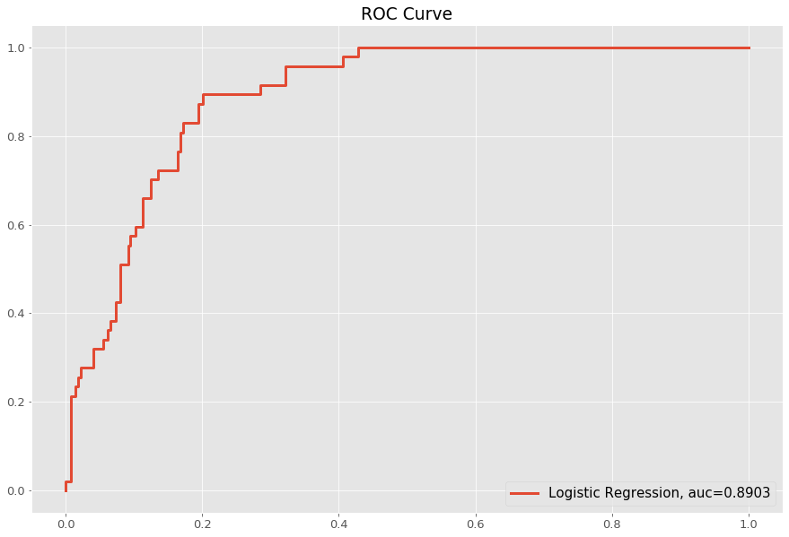
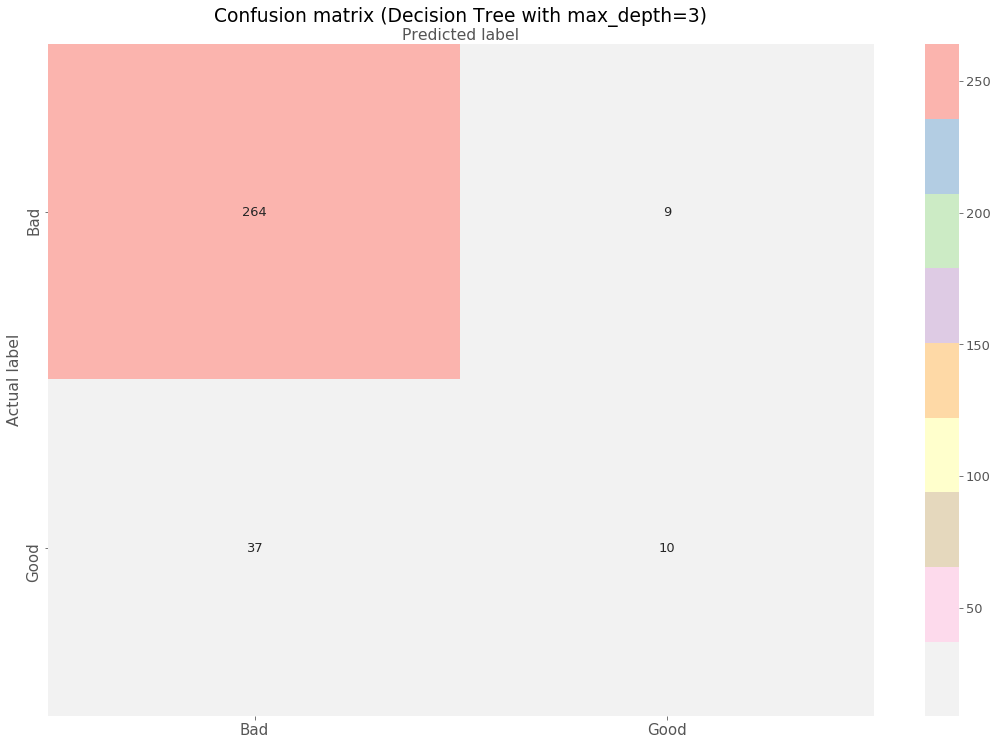
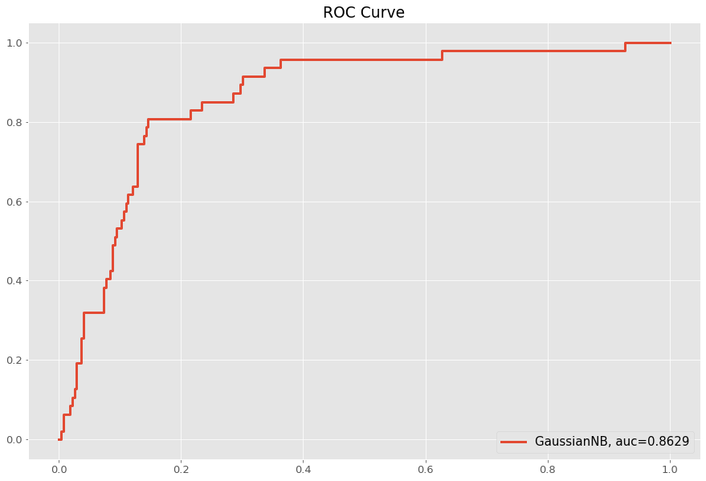

# Wine Classification

2019-24567 구연재

## I. Dataset & Models

데이터셋의 경우 kaggle에 공개된 red wine quality 데이터셋을 사용했으며, 각 와인에 대해 2점부터 8점까지 매겨진 quality값을 2~6점(Bad), 7~8점(Good)의 두 구간으로 나누어 **binary classification**을 하도록 학습시켰다. 원본 데이터셋에서 전체 1,599개의 와인 중 1,382개는 Bad, 217개는 Good으로 분류되었으며 이 중 **80%는 훈련에, 20%는 테스트**에 사용하였다.

학습을 위해서는 `scikit-learn` 라이브러리에서 제공하는 Logistic regression, k-Nearest neighbors, SVM, Decision tree, Random forest 그리고 Gaussian NB 까지의 총 6개의 모델을 사용하였으며 모델별로 파라미터값을 조정해가며 **정확도(Precision 기준) 90% 이상이 되는 분류기를 찾아내는 것을 목표**로 하였다.

## II. Classification Results

각 모델에 대해 파라미터값을 조정해가며 accuracy, precision, recall 값을 구하여 비교해 보았으며, 또다른 metric으로는 ROC Curve를 사용했다. 가장 정확도(Precision 기준)가 높게 나온 모델에 대해서는 confusion matrix를 첨부했다. 결과는 다음과 같다. 

### 1. Logistic Regression

Logistic Regression은 Default 파라미터에 대해서만 평가해보았다.

> Acuuracy, Precision, Recall for all parameters

| Parameter | Accuracy | Precision | Recall |
| :-------: | :------: | :-------: | :----: |
|  Default  |  0.875   |   0.706   | 0.255  |

위의 결과를 보면 알 수 있듯, Logistic Regression에서는 Recall 지표가 매우 낮게 나오는 것을 확인할 수 있었다. 전체적으로 'Bad'로 많이 판단하는 것이다. 아래 Confusion matrix를 통해서도 전체 47개의 'Good' 라벨 중 12개밖에 맞추지 못한 것을 확인할 수 있다.

> Confusion matrix for the best precision

> ROC Curve

ROC 커브는 위와 같이 표현되었으며, AUC값은 0.8903이다.

### 2. k-Nearest Neighbors

Nearest Neighbors 모델에서는 neighbors의 수를 각각 1, 3, 5로 설정해보며 평가해보았다. 결과는 다음과 같다.

> Acuuracy, Precision, Recall for all paramaters

|    Parameter    | Accuracy | Precision | Recall |
| :-------------: | :------: | :-------: | :----: |
| n_neighbors = 1 |  0.891   |   0.866   | 0.875  |
| n_neighbors = 3 |  0.615   |   0.559   | 0.613  |
| n_neighbors = 5 |  0.681   |   0.404   | 0.404  |

> Confusion matrix for the best precision

위의 표에서 알 수 있듯, 정확도는 neighbor의 수가 1일 때 가장 높았다. 또한 Accuracy, Precision, Recall 값 모두 어느 하나에 치우쳐지지 않고 비슷한 경향을 유지하는 것을 확인할 수 있었다.

> ROC Curve

반면, ROC 커브의 경우 AUC가 neighbor의 수가 많을수록, 즉 이웃의 수가 5일 때 가장 값이 높다는 반대의 결과가 나왔다.

데이터셋의 분포를 보면, 전체 1,599개의 와인의 86.4%에 해당하는 1,382개가 Bad 클래스의 와인인데, 이러한 **클래스간 분포의 불균형이 Accuracy 또는 Precision과, ROC Curve에서의 AUC값 간의 반대 결과를 초래**한 것으로 예상된다.

### 3. SVM

SVM 모델에서는 kernel, C, gamma값을 바꿔가며 평가를 시행해보았다. kernel은 linear와 rbf, C값과 gamma값은 0.1과 1.4를 넣어가며 결과를 비교해보았다.

> Acuuracy, Precision, Recall for all paramaters

| Parameter (kernel, C, gamma) | Accuracy  |  Precision  |  Recall   |
| :-------------------------------: | :-------: | :---------: | :-------: |
|        (linear, 0.1, 0.1)         |   0.853   | 0 (TP+FP=0) | 0 (TP=0)  |
|        (linear, 0.1, 1.4)         |   0.853   | 0 (TP+FP=0) | 0 (TP=0)  |
|        (linear, 1.4, 0.1)         |   0.853   | 0 (TP+FP=0) | 0 (TP=0)  |
|        (linear, 1.4, 1.4)         |   0.853   | 0 (TP+FP=0) | 0 (TP=0)  |
|          (rbf, 0.1, 0.1)          |   0.853   | 0 (TP+FP=0) | 0 (TP=0)  |
|          (rbf, 0.1, 1.4)          |   0.853   | 0 (TP+FP=0) | 0 (TP=0)  |
|          (rbf, 1.4, 0.1)          |   0.878   |    0.750    |   0.255   |
|        **(rbf, 1.4, 1.4)**        | **0.913** |  **0.952**  | **0.426** |

**SVM의 경우 전체적으로 Recall이 낮게나온다는 특징**이 있었다. 특히, kernel=rbf, C=1.4 인 경우를 제외하고는 모든 파라미터 옵션에 대해 True Positive와 False Positive가 0으로 나왔다.

> Confusion matrix for the best precision

가장 정확도가 높게 나온 경우는 **kernel=rbf, C=1.4, gamma=1.4** 일 때로, **목표했던 정확도를 넘긴 95.2%**를 달성했다. 위의 confusion matrix를 보면 앞선 다른 모델에 비해 False Positive(Bad를 Good으로 판단하는 경우)가 매우 낮은 것을 확인할 수 있었다.

> ROC Curve

ROC 커브에서 AUC값은 kernel=rbf, gamma=1.4에 해당하는 두 경우가 0.92를 넘긴 수치를 기록함으로써 가장 높았다. 앞서 **가장 정확도가 높게 나왔던 kernel=rbf, C=1.4, gamma=1.4가 ROC 커브에서도 두번째로 높은 수치**를 가졌기에, **두 메트릭에서 모두 좋은 분류기**라고 판단할 수 있었다.

### 4. Decision Tree

Decision Tree 모델은 max_depth 파라미터를 3과 None으로 설정하여 평가해보았다.

>Acuuracy, Precision, Recall for all paramaters

|    Parameter     | Accuracy | Precision | Recall |
| :--------------: | :------: | :-------: | :----: |
|  max_depth = 3   |  0.856   |   0.526   | 0.213  |
| max_depth = None |  0.850   |   0.489   | 0.489  |

> Confusion matrix for the best precision

실험 결과, max_depth가 3일 때가 0.526으로, max_depth=None(0.489)일 때보다 정확도가 높게 나왔다. 

> ROC Curve

ROC Curve의 AUC값을 통해 비교해본 결과, 이 경우에도 max_depth=3인 경우가 더 좋은 결과를 나타내었으며, 0.8440과 0.7007으로 비교적 매우 뚜렷한 차이를 확인해볼 수 있었다.

### 5. Random Forest

Random Forest 모델에서는 n_estimator의 값을 100, 200으로 조정해보며 평가를 수행했다.

>Acuuracy, Precision, Recall for all paramaters

|     Parameter     | Accuracy | Precision | Recall |
| :---------------: | :------: | :-------: | :----: |
| n_estimator = 100 |  0.894   |   0.741   | 0.426  |
| n_estimator = 200 |  0.884   |   0.708   | 0.362  |

> Confusion matrix for the best precision

Random Forest의 경우 n_estimator가 100일 때와 200일 때 각각 74.1%, 70.8%의 정확도를 보였다. 다만 SVM의 경우와 마찬가지로 Recall값이 낮다는 특징이 있었다.

> ROC Curve

ROC 커브에서는 두 가지 경우 모두 AUC가 0.93이 넘는 비슷한 높은 수치를 나타내었다. 이는 가장 정확도가 높았던 SVM보다도 높은 수치로, **RF모델 또한 SVM만큼이나 괜찮은 분류를 하고 있다고 판단해볼 수 있었다.**

### 6. GaussianNB

마지막으로는 GaussianNB 모델을 Default 파라미터로 두고 평가해보았다.

>Acuuracy, Precision, Recall for all paramaters

| Parameter | Accuracy | Precision | Recall |
| :-------: | :------: | :-------: | :----: |
|  Default  |  0.853   |   0.500   | 0.745  |

> Confusion matrix for the best precision

GaussianNB 모델의 경우 앞서 살펴본 다른 모델들과는 다르게, **Recall 값이 높고 오히려 Precision 값이 낮다는 특징**이 있었다. 

> ROC Curve

ROC 커브의 AUC값은 위와 같이 나타낼 수 있었다.

## III. Discussion

위에서 각 모델에 대해 어떤 파라미터가 가장 좋은지를 살펴보았다면, 이번에는 각 모델간의 비교를 위해 위에서 살펴본 모든 **6가지 모델**들에 대해 **가장 높은 정확도**와 **가장 높은 AUC값**을 비교해보았다.

그 결과 정확도에 대해서는 SVM이 95.2%로 가장 높았고, Nearest Neighbors(86.6%)가 이를 뒤따랐다. AUC값의 경우 Random Forest가 0.9327로 가장 높았으며, 미세한 차이로 SVM(0.9284)이 뒤따랐다. 그 다음은 Logistic Regression(0.8903)이었다.

정확도와 AUC, 두 metric 모두에서 **SVM(kernel=rbf, C=1.4, gamma=1.4)이 뛰어난 성능**을 보였으며, 간혹 모델별로 메트릭 간 결과에 차이가 있는 이유에는 앞서 언급했듯 **클래스간 분포의 불균형**(전체 데이터셋의 86.4%가 Bad 클래스)이 영향을 미쳤을 것으로 예상된다.

|               |  LR   |  NN   |    SVM    |  DT   |  RF   |  GNB  |
| :-----------: | :---: | :---: | :-------: | :---: | :---: | :---: |
| **Precision** | 0.706 | 0.866 | **0.952** | 0.526 | 0.741 | 0.500 |

## IV. Conclusion

red wine quality 데이터셋에 대해, qulaity값을 Bad와 Good의 두 구간으로 나누어 **binary classification**을 해보았다. Logistic regression, k-Nearest neighbors, SVM, Decision tree, Random forest 그리고 Gaussian NB 까지의 총 6개의 모델을 파라미터 조정을 통해 사용하였으며, **정확도와 AUC 두 metric**을 통해 모델간의 비교를 수행했다.

그 결과, 정확도에 대해서는 SVM(95.2%)과 Nearest Neighbors(86.6%)순으로 높았고, AUC에 대해서는 Random Forest(0.9327), SVM(0.9284)순으로 높았다. 이를 통해 **SVM 모델이 전체적으로 준수한 결과를 보여준 분류기**라고 판단할 수 있었으며, 특히 **SVM의 경우 파라미터가 kernel=rbf, C=1.4, gamma=1.4 일 때, 목표했던 정확도를 넘긴 95.2%를 달성**하였다.
