# 코로나 바이러스와 전염병 모델 시뮬레이션

## Settings

### Datasets

데이터셋은 covid-19[1]의 `countries-aggregated.csv` 를 사용하였으며, 2020년 1월 22일부터 5월 30일까지의 한국, 미국, 이탈리아, 일본에 대한 데이터만을 추출해 사용하였다.

### Parameters

위의 원본 데이터 그래프를 기반으로 하여, SEIR/SEIRD/SIR 모델에 대해 최적의 파라미터를 **heuristic**하게 대입해가며 찾아보았다. 이를 통해 모델 시뮬레이션에 사용한 최적 파라미터는 다음과 같다.

> #### 한국 

|                 | SIR               | SEIR              | SEIRD             |
| --------------- | ----------------- | ----------------- | ----------------- |
| **N**           | 51785790          | 51785790          | 51785790          |
| **Alpha**       | -                 | -                 | 0.01              |
| **Beta**        | 0.222             | 0.352             | 0.354             |
| **Gamma**       | 1/25              | 1/25              | 1/25              |
| **Delta**       | 1/3               | 1/3               | 1/3               |
| **Rho**         | -                 | -                 | 1/9               |
| **R0**          | 5.55              | 8.8               | 8.85              |
| **R0 감소지점** | 50일째에 95% 감소 | 50일째에 95% 감소 | 50일째에 95% 감소 |

> #### 미국

|                 | SIR               | SEIR              | SEIRD             |
| --------------- | ----------------- | ----------------- | ----------------- |
| **N**           | 331002651         | 331002651         | 331002651         |
| **Alpha**       | -                 | -                 | 0.03              |
| **Beta**        | 0.176             | 0.44              | 0.446             |
| **Gamma**       | 1/100             | 1/100             | 1/80              |
| **Delta**       | 1/7.89            | 1/7.89            | 1/7.89            |
| **Rho**         | -                 | -                 | 1/9               |
| **R0**          | 17.6              | 44                | 35.7              |
| **R0 감소지점** | 80일째에 80% 감소 | 80일째에 90% 감소 | 80일째에 87% 감소 |

> #### 이탈리아

|                 | SIR                                      | SEIR                                     | SEIRD                                    |
| --------------- | ---------------------------------------- | ---------------------------------------- | ---------------------------------------- |
| **N**           | 60461826                                 | 60461826                                 | 60461826                                 |
| **Alpha**       | -                                        | -                                        | 0.055                                    |
| **Beta**        | 0.215                                    | 0.615                                    | 0.626                                    |
| **Gamma**       | 1/40                                     | 1/40                                     | 1/35                                     |
| **Delta**       | 1/4.01                                   | 1/8.08                                   | 1/8.08                                   |
| **Rho**         | -                                        | -                                        | 1/9                                      |
| **R0**          | 8.6                                      | 24.6                                     | 21.9                                     |
| **R0 감소지점** | 60일째에 80% 감소 90일째에 90% 감소 | 60일째에 93% 감소 80일째에 80% 감소 | 60일째에 90% 감소 80일째에 70% 감소 |

> #### 일본

|                 | SIR               | SEIR              | SEIRD             |
| --------------- | ----------------- | ----------------- | ----------------- |
| **N**           | 126476261         | 126476261         | 126476261         |
| **Alpha**       | -                 | -                 | 0.03              |
| **Beta**        | 0.164             | 0.228             | 0.233             |
| **Gamma**       | 1/17              | 1/15              | 1/15              |
| **Delta**       | 1/3               | 1/3               | 1/3               |
| **Rho**         | -                 | -                 | 1/9               |
| **R0**          | 2.78              | 3.425             | 3.5               |
| **R0 감소지점** | 90일째에 95% 감소 | 90일째에 95% 감소 | 90일째에 95% 감소 |

## Simulation

국가별로 SIR, SEIR, SEIRD 모델에 대해 찾은 최적 파라미터를 기반으로 한 그래프는 다음과 같다. 각 모델에 대한 그래프와, 마지막 셀에는 비교에 용이하도록 원본 데이터에 대한 그래프를 삽입했다.

### 한국

|        SIR Model         |       SEIR Model        |
| :----------------------: | :---------------------: |
|  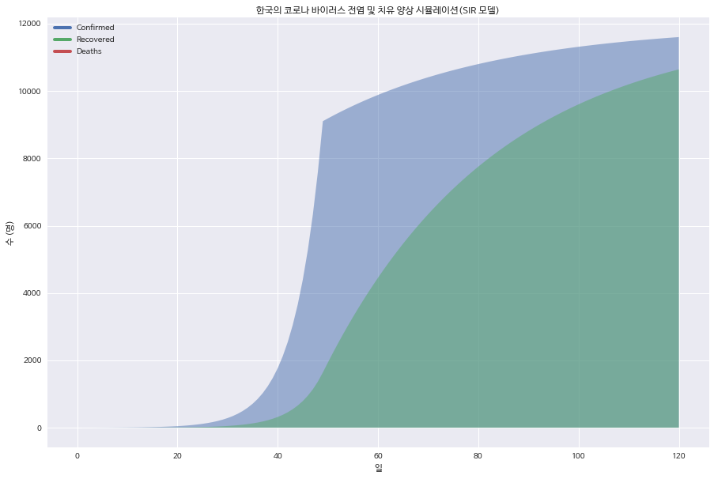  | 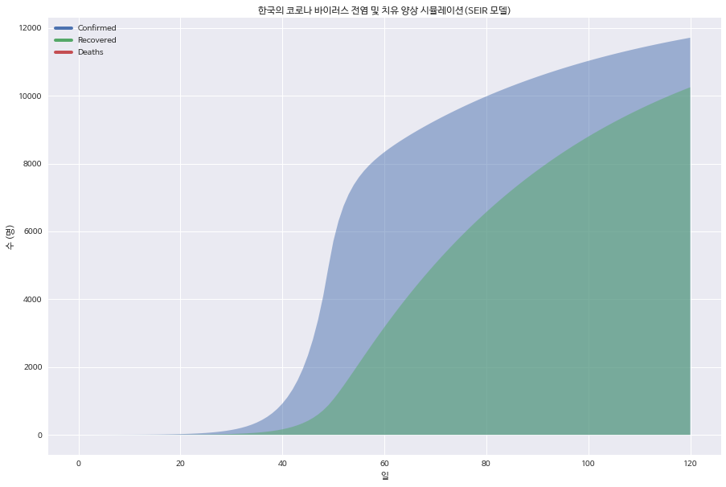 |
|     **SEIRD Model**      |      **Real Data**      |
|  |   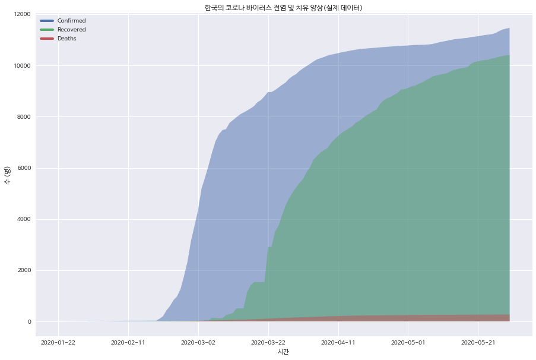    |

### 미국

|       SIR Model       |      SEIR Model      |
| :-------------------: | :------------------: |
|  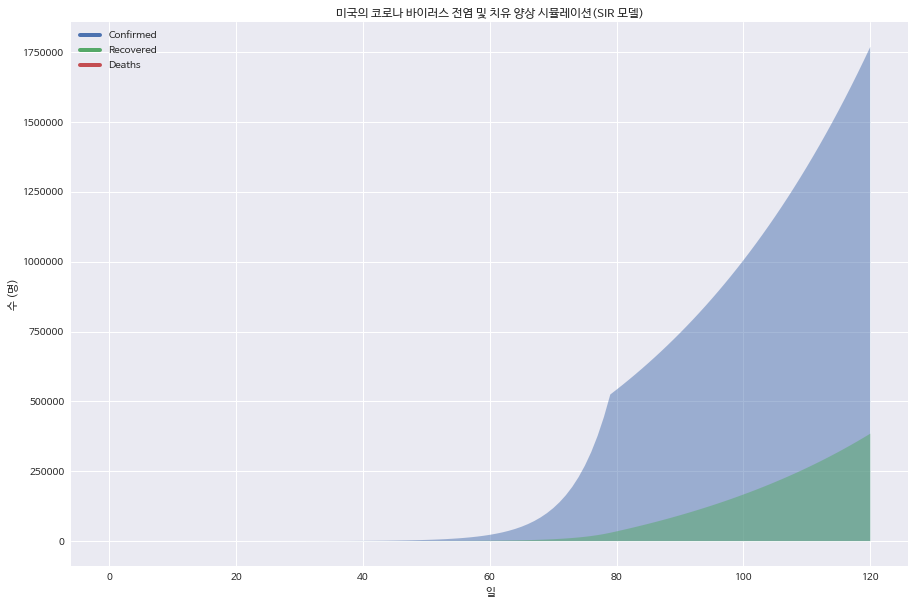  | 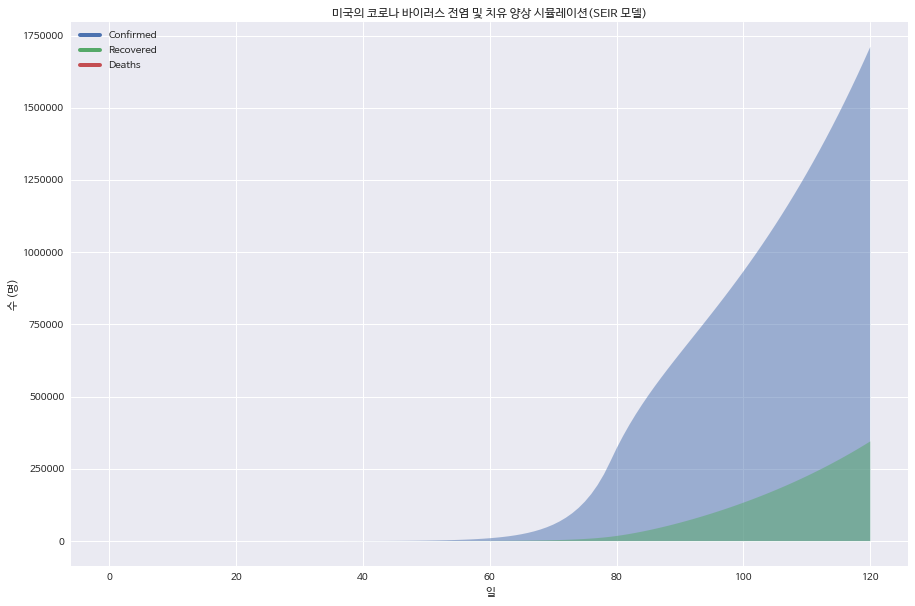 |
|    **SEIRD Model**    |    **Real Data**     |
| 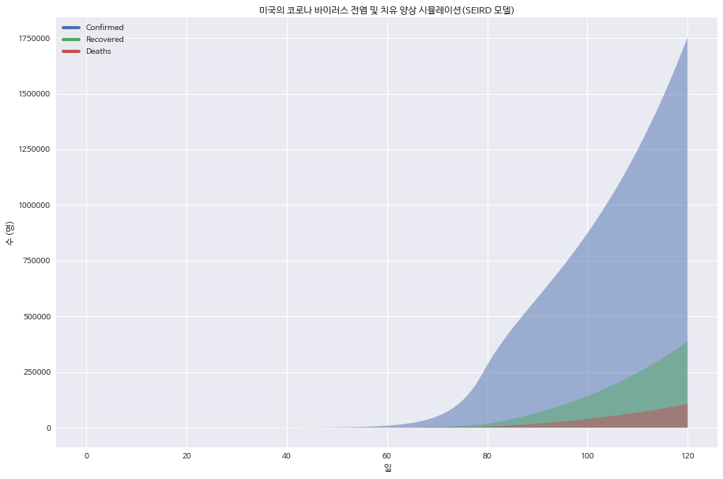 |   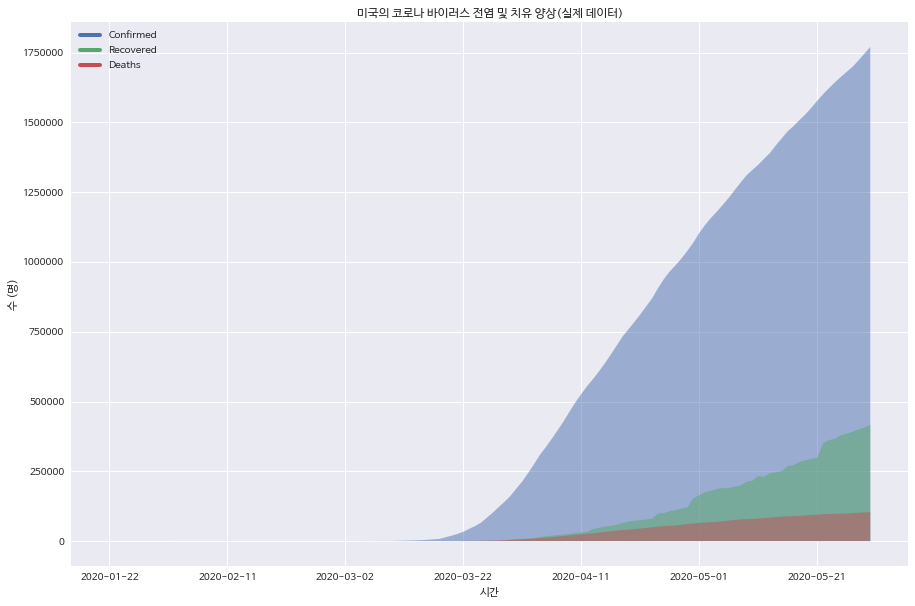    |

### 이탈리아

|        SIR Model         |       SEIR Model        |
| :----------------------: | :---------------------: |
|  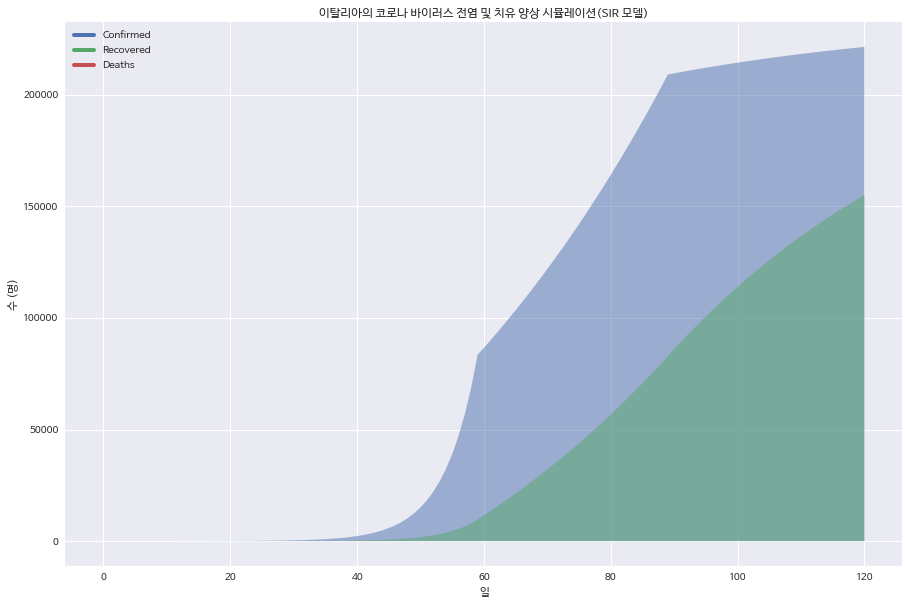  | 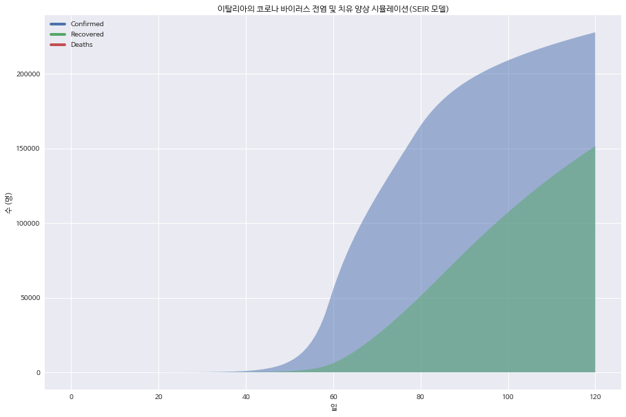 |
|     **SEIRD Model**      |      **Real Data**      |
| 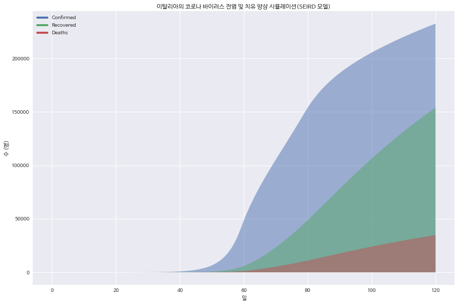 |   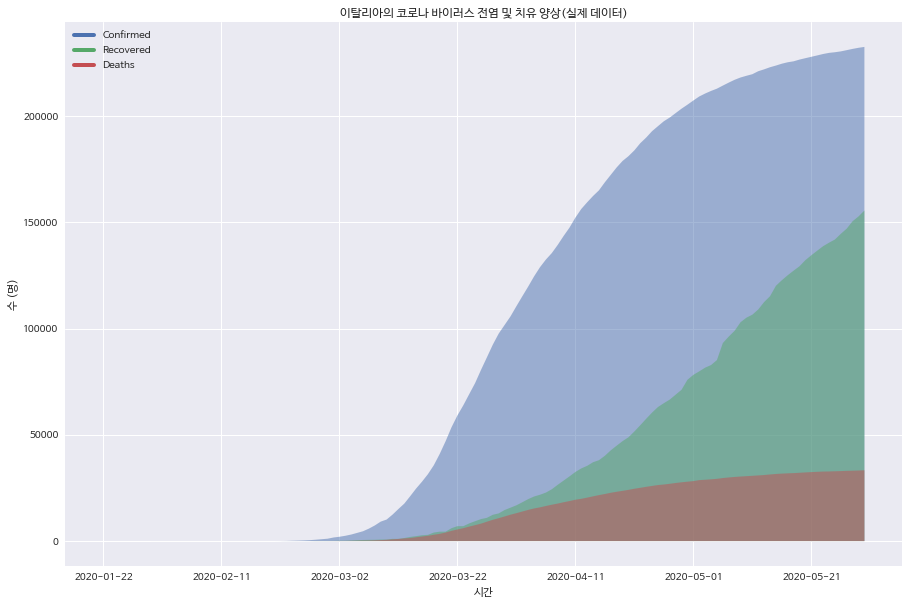    |

### 일본

|        SIR Model         |       SEIR Model        |
| :----------------------: | :---------------------: |
|  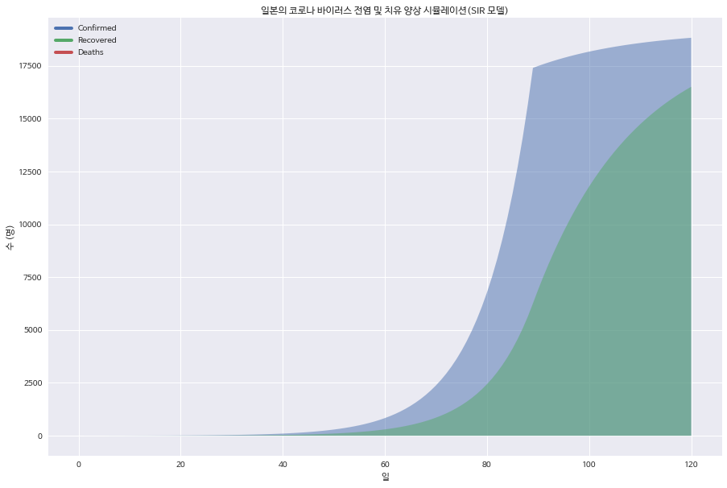  |  |
|     **SEIRD Model**      |      **Real Data**      |
| 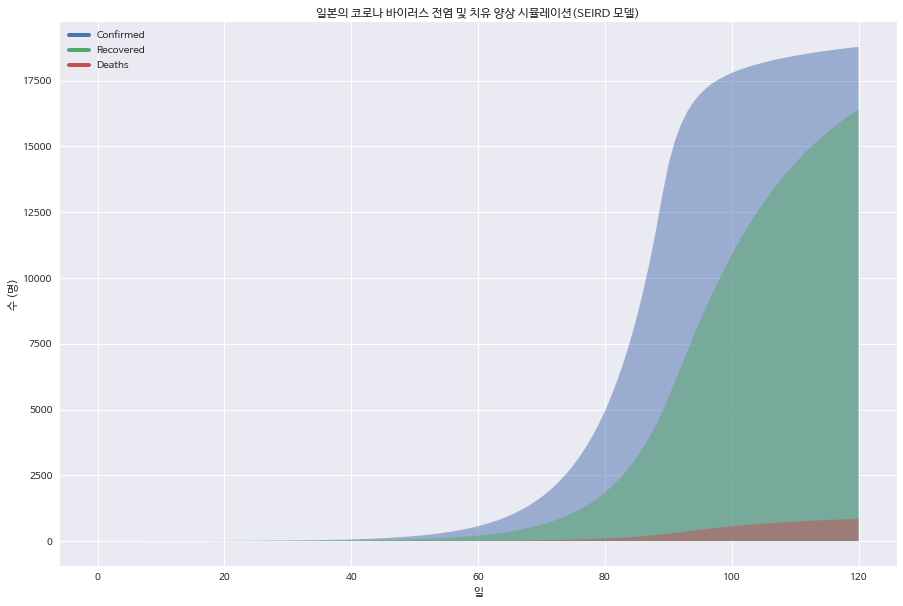 |   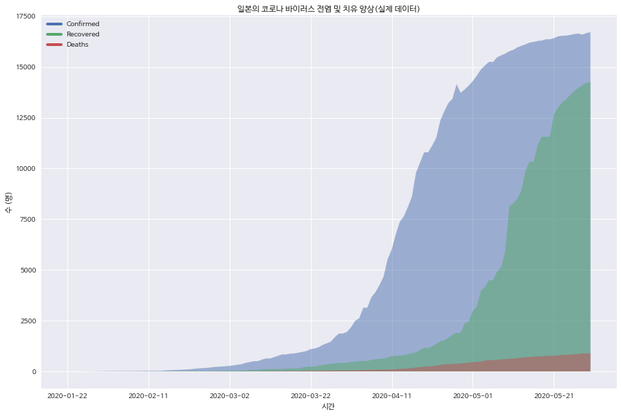    |

## Discussion

시뮬레이션 결과, **SEIRD 모델이 현실의 데이터를 가장 정확하게 표현**하는 것을 확인할 수 있었다. 하지만 이를 위해선 R0값을 중간에 변화시켜야 했는데, 이는 **사회적 거리두기에 따라 beta값(노출확률)이 현저히 감소**하기 때문이다. 찾아낸 최적 파라미터에 따르면, **한국과 일본의 경우 beta값을 초기의 95%까지 감소**시켜야 현실과 근접한 그래프를 얻을 수 있었다. 이를 통해 실제로 **국가에서 시행하는 사회적 거리두기의 효과를 간접적으로 확인**해볼 수 있었다.

또한 **이탈리아**의 경우 R0를 두 번 감소시켜야 현실과 유사한 그래프를 얻을 수 있었는데, 이를 통해 이탈리아에서 **초기에는 전혀 사회적 거리두기가 시행되지 않았지만 후에는 R0값이 다른 국가와 유사한 수준으로 감소**하게 되었다고 유추해볼 수 있었다.

**미국**의 경우, 다른 국가들과 다르게 **여전히 가파른 상승세**를 보이고 있다는 점에서 이탈리아와같이 앞으로 한번 더 **큰 폭의 R0값에 대한 감소가 있어야 다른 국가와 비슷한 수준으로 완만한 상승곡선에 진입**할 것이 예상되었다.

하지만 현실을 더욱 정확하게 반영하기 위해서는 R0값이 급상승 하는 시점 (집단감염이 일어나는 경우 등) 또한 고려해야 할 것이다.

## Conclusion

본 과제에서는 한국, 미국, 이탈리아, 일본의 코로나 바이러스 데이터를 각각 SIR, SEIR, SEIRD 모델에 대해 맞추어보고 각 나라별로 어떤 모델이 가장 정확하며 각 모델의 최적 parameter는 무엇인지 알아보는 것을 목표로 하였다. 그 결과, SEIRD 모델이 가장 현실을 잘 나타낸다는 것과 현실을 제대로 반영하기 위해서는 사회적 거리두기에 따른 R0값의 감소가 모델에 포함되어야 한다는 것을 알게 되었으며, 이를 통해 사회적 거리두기의 효과에 대해 간접적으로 확인해볼 수 있었다. 하지만 현실을 더욱 정확하게 반영하기 위해서는 R0값이 급상승 하는 시점 (집단감염이 일어나는 경우 등) 또한 고려해야 할 것이다.

## Codes

* [Github](https://github.com/ricegood/socialcom/tree/master/project8)에 업로드
  * `corona.ipynb`

## References

[1] covid-19 datasets, https://github.com/datasets/covid-19/tree/master/data

[2] Epidemic Calculator, http://gabgoh.github.io/COVID/index.html